Click [here](../README.md) to return to the summary page.

## 1. Introduction

Greenspace is an important part of urban life, with benefits for humans and the environment. Analysing Bradford local authority district (LAD), this study builds on the growing literature addressing the challenge of greenspace accessibility by focusing on each deprivation dimension. Results show that considering deprivation and the relationship with greenspace in this greater level of detail is important for future policy and development.

## 2. Background
### 2.1. Why is greenspace important?
Natural England (2023) estimates benefits of £6.6 billion in health, climate, and environmental gains from greenspace. However, a third of people do not have access to quality greenspace within a 15-minute walk of their home (Natural England, 2023). Public policy highlights commitments to improve this, with the Green Infrastructure Framework seeking to determine where greenspace is needed (Natural England, 2023).

### 2.2. Why Bradford?
Bradford is the fifth largest district in England (CBMDC, 2021) and has a young population, ranking 4th for children aged 14 or less (21.4%) (CBMDC, 2022). Bradford is diverse – a third of people identify as Muslim, nearly 20% were born outside the UK, and 39% are Black, Asian, Mixed, or “Other” non-White ethnicities (ONS, 2023h). Over a fifth of the population have poor health, and a fifth are disabled (ONS, 2023h).

Greenspace assets include extensive moorland and woodland as well as 36 council recognised parks (CBMDC, 2019). There are sports grounds and facilities, but not all are freely accessible. Limited utilisation data exists, but estimates suggest it is below national and regional averages, with surveys finding those most likely to utilise urban greenspace were ethnic minorities, households without a car, and people with children (CBMDC, 2019).

The council recognise the need to embed greenspace within long-term strategies. Key ambitions include ensuring greenspaces are safe and inclusive, improving health outcomes by prioritising investment for those most in need (CBMDC, 2021).

### 2.3. Review of current literature
An increasing body of literature acknowledges the connection between greenspace access and overall health (Jia et al, 2021; Lachowycz and Jones, 2011; McCormick, 2017) and social benefits, including community cohesion (Barbosa et al, 2007). Methodologies vary, but most find deprived communities have the best access whilst utilisation levels are unclear, but perception of quality can limit use (Barbosa et al, 2007; Jones et al, 2009; Kessel et al, 2009; Roe et al, 2016). This quality issue is worse in deprived areas (Gidlow and Ellis, 2011; Mears et al, 2019).

Several Bradford-specific studies exist. Mueller et al (2018) analysed health impacts and determined greenspace promotes an active lifestyle, and helps mitigate pollution, noise, and heat effects. McEachan et al (2018) demonstrated the positive impact greenspace had on children, but this impact differed by ethnicity, and perceived quality of greenspace was more important than quantity. Perception has also been linked to biodiversity and facilities (Wood et al, 2018).

## 3. Research question
No literature reviewed analyses the dimensions of deprivation. This study aims to investigate whether there is a statistically significant relationship between greenspace access and each dimension of the 2021 UK Census deprivation measure. The null hypothesis is that there is not a statistically significant relationship present.

The remainder of this notebook will be structured as follows: Section 4 explains the datasets used; Section 5 outlines data wrangling processes preparing for analysis; Section 6 presents visual analyses and statistical descriptors of the data; Section 7 includes analysis and results of the OLS regression, Moran’s I and LISA cluster evaluation, and subsequent GWR model; Section 8 discusses findings, how this could influence policy, and further opportunities to improve this study; Section 9 draws conclusions from the findings.

## 4. Data
### 4.1. Import libraries

```python
# Set number of threads to recommended 7 to avoid errors in code during visualisation phase
import os
os.environ["OMP_NUM_THREADS"] = '7'
```


```python
# Dataframe libraries
import pandas as pd
import geopandas as gpd

# Visualisation libraries
import matplotlib.pyplot as plt
import folium
import contextily as ctx
import seaborn as sns
import matplotlib.patches as mpatches
import matplotlib.colors as mcolors
from matplotlib.lines import Line2D

# Regression libraries
import statsmodels.api as sm # add statsmodels
from statsmodels.sandbox.regression.predstd import wls_prediction_std # for predictions

# Spatial analysis libraries
from pysal.lib import weights
from pysal.lib import io
from pysal.explore import esda
from pysal.viz import splot
from splot.esda import moran_scatterplot, lisa_cluster, plot_local_autocorrelation
from mgwr.gwr import GWR, MGWR
from mgwr.sel_bw import Sel_BW

# Other required libraries
%matplotlib inline
import numpy as np
from scipy.stats import probplot
import scipy.stats as stats
```
  

### 4.2. Import each datafile
**Links to datafiles are located in the appendix to this notebook and can be downloaded and saved locally using the links provided.**

#### 4.2.1. Output Areas (OAs)
OAs are the lowest census geography level, containing 40 to 250 households (ONS, 2021), enabling more accurate nearest greenspace measurements, and capturing localised differences in deprivation. Polygons and population weighted centroids (PWCs) are available from the ONS (2023a, 2023b). PWCs are used to measure distance to greenspace as it captures the nearest greenspace for most households. Polygons are aggregated to Bradford LAD level using the ONS (2023c) lookup. This is necessary to reduce the OA PWCs and greenspace to those within Bradford LAD.

```python
# OA polygons (BFC: Full resolution - clipped to the coastline (Mean High Water mark)) (ONS, 2023a)
OA_polygons = gpd.read_file('Data/Output_Areas_2021_EW_BFC_V8/OA_2021_EW_BFC_V8.shp')

# OA Population-weighted centroids (ONS, 2023b)
OA_PWC = gpd.read_file('Data/Output_Areas_2021_PWC_V3/PopCentroids_EW_2021_V3.shp')
```


```python
# OA to LSOA to MSOA to LAD lookup (ONS, 2023c)
OA_lookup = pd.read_csv('Data/Output_Area_Lookup_in_England_and_Wales_v3.csv')

### Error can be ignored - it is because of Welsh spellings in a certain column.
### This is not relevant to, nor will it affect, this study as these columns/rows will not be used.
```


#### 4.2.2. Greenspace
Greenspace data (OS, 2023) include site (polygon) and access (point) data. However, not all sites have access data, hence only sites are used to ensure all eligible greenspace is captured. Distance from the PWC to nearest greenspace will be calculated using these polygons. Data includes parks, gardens, sports facilities, and religious grounds, but does not include forests, woodland, moorland or canal and river paths (OS, 2023).


```python
# Greenspace site polygons (OS, 2023)
GB_greenspace_site = gpd.read_file('Data/OS Open Greenspace (ESRI Shape File) GB/data/GB_GreenspaceSite.shp')
```

#### 4.2.3. Independent variables
Each deprivation dimension (education, employment, health and disability, and housing) can be obtained via custom ONS queries (ONS, 2023d; ONS, 2023e; ONS, 2023f; ONS, 2023g). These queries include only Bradford LAD OAs. Each file contains the number of households that are deprived or not deprived, from which percentage of households deprived in each dimension is calculated (Section 5.4.) creating the independent variables for regression modelling.


```python
# Data for Bradford OAs only, from 2021 Census

# Household deprivation in the education dimension (ONS, 2023d)
HHD_dep_education_raw = pd.read_csv('Data/2021 Census Data/Household deprived in the education dimension.csv')

# Household deprivation in the employment dimension (ONS, 2023e)
HHD_dep_employment_raw = pd.read_csv('Data/2021 Census Data/Household deprived in the employment dimension.csv')

# Household deprivation in the health and disability dimension (ONS, 2023f)
HHD_dep_health_raw = pd.read_csv('Data/2021 Census Data/Household deprived in the health and disability dimension.csv')

# Household deprivation in the housing dimension (ONS, 2023g)
HHD_dep_housing_raw = pd.read_csv('Data/2021 Census Data/Household deprived in the housing dimension.csv')
```

## 5. Data wrangling
### 5.1. OAs
Only Bradford LAD OAs are needed. The OA lookup and geometry dataframes can be merged, retaining only Bradford as identified by the LAD22NM column. There are 1,575 OAs within Bradford LAD.


```python
# Remove unnecessary columns from OA lookup, keeping only required columns in new dataframe
OA_lookup_trim = OA_lookup[['OA21CD','LAD22CD','LAD22NM']]
```


```python
# Filter OA lookup to just Bradford
Bradford_OA_lookup = OA_lookup_trim[OA_lookup_trim['LAD22NM'] == 'Bradford']
```


```python
# Check how many OAs are left - this number is an important reference point for further data wrangling tasks
len(Bradford_OA_lookup)
```


 1575


```python
# Merge Bradford_OA_lookup with OA polygons to reduce the geodataframe containing the polygons to only Bradford OAs
Bradford_OA_polygons = OA_polygons.merge(Bradford_OA_lookup, how='right', on='OA21CD')
```


```python
# Check number of OAs is same as in the reduced Bradford OA lookup dataframe
print(len(Bradford_OA_polygons))
print(len(Bradford_OA_polygons) == len(Bradford_OA_lookup))
```

1575

True
    


```python
# Merge Bradford_OA_lookup with OA PWCs to reduce the geodataframe containing the PWCs to only Bradford OAs
Bradford_OA_PWC = OA_PWC.merge(Bradford_OA_lookup, how='right', on='OA21CD')
```


```python
# Check number of OAs is same as in the reduced Bradford OA lookup dataframe
print(len(Bradford_OA_PWC))
print(len(Bradford_OA_PWC) == len(Bradford_OA_lookup))
```

1575

True
    


```python
# Drop unrequired columns
Bradford_OA_polygons_tidy = Bradford_OA_polygons.drop([
    'LSOA21CD','LSOA21NM','LSOA21NMW','BNG_E','BNG_N','LAT','LONG','GlobalID','LAD22CD','LAD22NM'], axis=1)
Bradford_OA_PWC_tidy = Bradford_OA_PWC.drop(['GlobalID','LAD22CD','LAD22NM'], axis=1)

# Rename geometry columns and set geometry
Bradford_OA_polygons = Bradford_OA_polygons_tidy.set_geometry('geometry').rename_geometry('Polygon')
Bradford_OA_PWC = Bradford_OA_PWC_tidy.set_geometry('geometry').rename_geometry('PWC')
```

### 5.2. Greenspace
Only greenspace within Bradford LAD is required. A Bradford LAD polygon is created to spatially match the greenspace, retaining only sites within Bradford LAD.

#### 5.2.1. Clean greenspace dataframe
Some types of greenspaces are arguably not for recreation (e.g. cemetery) and some are not always free to the public (e.g. golf course). To ensure this analysis includes only freely accessible greenspace for recreational use, types are reduced to 'play space', 'playing field' and 'public park or garden'.


```python
# Remove unnecessary columns, keeping only required columns in new dataframe
GB_greenspace_site_trim = GB_greenspace_site[['id','function','geometry']]

# Rename remaining columns for clarity
GB_greenspace_site_trim = GB_greenspace_site_trim.rename(columns={"id": "Greenspace_ID", "function": "Type"})
GB_greenspace_site_trim = GB_greenspace_site_trim.set_geometry('geometry').rename_geometry('Polygon')
```


```python
# Check what types are included in the data
GB_greenspace_site_trim.Type.value_counts()
```


| Type                                    |          |
|:---------------------------------------:|:--------:|
| Play Space                              | 42972    |
| Religious Grounds                       | 22229    |
| Playing Field                           | 21377    |
| Other Sports Facility                   | 15073    |
| Allotments Or Community Growing Spaces  | 13002    |
| Public Park Or Garden                   | 11982    |
| Cemetery                                | 7559     |
| Tennis Court                            | 6632     |
| Bowling Green                           | 6589     |
| Golf Course                             | 3000     |

Name: count, dtype: int64


```python
# Keep only 'Play Space', 'Playing Field', and 'Public Park Or Garden'
GB_greenspace_site_filtered = GB_greenspace_site_trim.loc[GB_greenspace_site_trim['Type'].
                                                          isin(['Play Space','Playing Field','Public Park Or Garden'])]
```

#### 5.2.2. Greenspace within Bradford LAD
Aggregating OA polygons to a single polygon and spatially matching to the greenspace dataframe isolates greenspace within Bradford LAD. This will be used to calculate the dependent variable for the regression analysis.


```python
# Create a copy of the Bradford_OA_polygons dataframe which will become the Bradford polygon dataframe
Bradford = Bradford_OA_polygons
# Add a 'Bradford' dummy column to aggregate on
Bradford['City'] = 'Bradford'
```


```python
# Create a single polygon aggregated to the city level using 'dissolve'
Bradford_polygon = Bradford.dissolve(by='City')
```


```python
# Drop OA21CD column as this is no longer relevant
Bradford_polygon = Bradford_polygon.drop(['OA21CD'], axis=1)
```


```python
# Spatial join for any greenspace that intersects the Bradford polygon
Bradford_greenspace_site = gpd.sjoin(GB_greenspace_site_filtered, Bradford_polygon, how='inner', predicate='intersects')
```


```python
# Drop index_right column as this is no longer relevant
Bradford_greenspace_site = Bradford_greenspace_site.drop(['index_right'], axis=1)
```


```python
# Check length of dataframe to determine how many greenspaces are included
len(Bradford_greenspace_site)
```

436


```python
# Check that the unique number of Greenspace_IDs is in fact the length of the dataframe
print(Bradford_greenspace_site['Greenspace_ID'].nunique())
print(len(Bradford_greenspace_site) == Bradford_greenspace_site['Greenspace_ID'].nunique())
```

436

True
    

#### 5.3. Dependent variable
The dependent variable is the distance between the OA PWC and nearest greenspace polygon calculated using the Euclidian distance and given in metres.


```python
# Find the nearest greenspace to each OA population-weighted centroid
nearest_greenspace = gpd.sjoin_nearest(
    Bradford_OA_PWC, Bradford_greenspace_site, how='left', distance_col='Distance')

# Drop the unrequired columns
nearest_greenspace = nearest_greenspace.drop(['PWC','index_right'], axis=1)
```


```python
# Check length of dataframe is equal to the length of the OA dataframe - i.e. one greenspace per OA has been identified
print(len(nearest_greenspace))
print(len(nearest_greenspace) == len(Bradford_OA_lookup))
```

1599

False
    

The information above shows there are some duplicated rows. This is confirmed by checking the number of unique OA21CDs which should be 1,575.


```python
# Check number of OA21CDs
print(nearest_greenspace['OA21CD'].nunique())
print(nearest_greenspace['OA21CD'].nunique() == len(Bradford_OA_lookup))
```

1575

True
    

Duplicates are caused by the same greenspace being allocated different 'Types' with unique IDs. These duplicates are removed, keeping the first record irrespective of 'Type' as no analysis is to be conducted on this.


```python
# Isolate duplicated rows and check cause
# Confirmed as duplicated sites with different Greenspace_IDs due to different greenspace Type being recorded
duplicated_rows = nearest_greenspace[nearest_greenspace.duplicated(subset='OA21CD', keep=False)]
duplicated_rows.head(6)
```


<table border="1" class="dataframe">
  <thead>
    <tr style="text-align: right;">
      <th></th>
      <th>OA21CD</th>
      <th>Greenspace_ID</th>
      <th>Type</th>
      <th>Distance</th>
    </tr>
  </thead>
  <tbody>
    <tr>
      <th>11</th>
      <td>E00053364</td>
      <td>0295ED18-F337-5C37-E063-AAEFA00A445E</td>
      <td>Play Space</td>
      <td>514.057891</td>
    </tr>
    <tr>
      <th>11</th>
      <td>E00053364</td>
      <td>0295ED18-F2F3-5C37-E063-AAEFA00A445E</td>
      <td>Playing Field</td>
      <td>514.057891</td>
    </tr>
    <tr>
      <th>42</th>
      <td>E00053392</td>
      <td>0295ED18-F337-5C37-E063-AAEFA00A445E</td>
      <td>Play Space</td>
      <td>364.166159</td>
    </tr>
    <tr>
      <th>42</th>
      <td>E00053392</td>
      <td>0295ED18-F2F3-5C37-E063-AAEFA00A445E</td>
      <td>Playing Field</td>
      <td>364.166159</td>
    </tr>
    <tr>
      <th>43</th>
      <td>E00053393</td>
      <td>0295ED18-F337-5C37-E063-AAEFA00A445E</td>
      <td>Play Space</td>
      <td>571.723915</td>
    </tr>
    <tr>
      <th>43</th>
      <td>E00053393</td>
      <td>0295ED18-F2F3-5C37-E063-AAEFA00A445E</td>
      <td>Playing Field</td>
      <td>571.723915</td>
    </tr>
  </tbody>
</table>
</div>


```python
# Drop duplicated rows and keep first row for duplicated instances
unique_nearest_greenspace = nearest_greenspace.drop_duplicates(subset='OA21CD', keep='first')
```


```python
# Check length of dataframe is now as expected
print(len(unique_nearest_greenspace))
print(len(unique_nearest_greenspace) == len(Bradford_OA_lookup))
```

1575

True
    

The 'Bradford_greenspace_site' dataframe created in 5.2. must also be updated to ensure a consistent view of greenspace.


```python
# Get unique list of Greenspace_IDs
unique_Greenspace_IDs = unique_nearest_greenspace[['Greenspace_ID']].drop_duplicates()
```


```python
# Join onto Bradford_greenspace_site to reduce this dataframe to just those kept in the unique_nearest_greenspace dataframe
Bradford_greenspace_site_unique = Bradford_greenspace_site.merge(unique_Greenspace_IDs, how='right', on='Greenspace_ID')
```

### 5.4. Independent variables
Deprivation data needs to be pivoted to create columns of the datapoints by OA and converting these into percentages. This is achieved using a function to repeat the process for each dimension. Resulting dataframes are merged into a final dataframe containing all four independent variables.


```python
def Independent_Variables_Setup(dataframe, dataframe_name):     # dataframe as object, dataframe_name as string
    
    # Create all required strings for naming dataframes throughout wrangling process
    core_name = dataframe_name.rstrip('_raw') # Remove "_raw" from end of dataframe to get core name
    dropped = core_name + '_dropped'          # Add "_dropped" to end of core name
    pivot = core_name + '_pivot'              # Add "_pivot" to end of core name
    percentage = core_name + '_PC'            # Add "_PC" to end of core name
    
    # Drop columns that are not required
    cols = [1,3]     # List of column indexes of the columns to drop
    dropped = dataframe.drop(dataframe.columns[cols], axis=1)     # Create new dataframe with columns dropped
    
    # Pivot the table on column[0], making the options from column[1] the new column headers and the data that from column[2]
    pivot = dropped.pivot_table(index=dropped.columns[0],
                                  columns=dropped.columns[1],
                                  values=dropped.columns[2]).reset_index()
    pivot.columns.name = None
    
    # Create a Total column from 3 new data columns[1,2,3]
    pivot['Total'] = pivot.iloc[:, 1:4].sum(axis=1)
    
    # Calculate % HHDs Deprived by dividing column[3] "Deprived" by the Total calculated above
    pivot[percentage] = (pivot.iloc[:,3]/pivot['Total'])
    
    # Create final dataframe keeping only the OA21CD and % HHDs deprived in the given dimension
    final_cols = [0,5]
    core_name = pivot.iloc[:, final_cols]
    
    return core_name
```


```python
# Household deprivation in the education dimension
HHD_dep_education = Independent_Variables_Setup(HHD_dep_education_raw, 'HHD_dep_education_raw')
```


```python
# Household deprivation in the employment dimension
HHD_dep_employment = Independent_Variables_Setup(HHD_dep_employment_raw, 'HHD_dep_employment_raw')
```


```python
# Household deprivation in the health and disability dimension
HHD_dep_health = Independent_Variables_Setup(HHD_dep_health_raw, 'HHD_dep_health_raw')
```


```python
# Household deprivation in the housing dimension
HHD_dep_housing = Independent_Variables_Setup(HHD_dep_housing_raw, 'HHD_dep_housing_raw')
```


```python
# Check all 4 dataframes are the same length and that length is as expected
len(HHD_dep_education) == len(HHD_dep_employment) == len(HHD_dep_health) == len(HHD_dep_housing) == len(Bradford_OA_lookup)
```


True


```python
# Merge education and employment
Ind_vars = HHD_dep_education.merge(HHD_dep_employment, how='inner', on='Output Areas Code')
# Add health
Ind_vars = Ind_vars.merge(HHD_dep_health, how='inner', on='Output Areas Code')
# Add housing
Ind_vars = Ind_vars.merge(HHD_dep_housing, how='inner', on='Output Areas Code')
```


```python
# Final length check
print(len(Ind_vars))
print(len(Ind_vars) == len(Bradford_OA_lookup))
```

1575

True
    

### 5.5. Final dataframe for regression analysis
A dataframe containing the dependent and independent variables, OA code and polygons is required for the regression models and spatial analysis.


```python
# Merge the unique_nearest_greenspace and Ind_vars dataframes to get a final dataframe for subsequent analysis
final_df = unique_nearest_greenspace.merge(Ind_vars, how='inner', left_on='OA21CD', right_on='Output Areas Code')
final_df = final_df.merge(Bradford_OA_polygons, how='inner', on='OA21CD')

# Drop unrequired columns
final_df = final_df.drop(['Output Areas Code', 'Greenspace_ID', 'Type', 'City'], axis=1)

# Set geometry
final_df = final_df.set_geometry('Polygon')
```

Visual checks of each dataframe can be found in Appendix 1.

## 6. Visualisation and Statistics
### 6.1. OAs

Figure 6.1.1. shows OA boundaries and PWCs within Bradford LAD. PWCs locations can vary from near the edge to the centre of OAs.

#### Figure 6.1.1. Map of OA polygons and population-weighted centroids within the Bradford LAD

<div style="color: #808080; margin-top: 5px">
    Data Source: ONS, 2023a; ONS, 2023b
</div>


```python
# Plot polygons
fig, ax = plt.subplots(figsize=(10, 10))
Bradford_OA_polygons.plot(ax=ax, color='Grey', edgecolor='black', linewidth=0.25, alpha=0.1)

# Plot points
Bradford_OA_PWC.plot(ax=ax, markersize=1, color='#134f5c')

# Customize plot
ax.set_axis_off()

# Add basemap
ctx.add_basemap(ax, crs=Bradford_OA_polygons.crs.to_string(), source=ctx.providers.CartoDB.Positron)

# Show plot
plt.show()
```


    
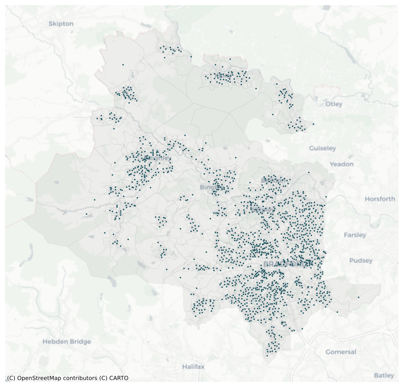
    


### 6.2. Greenspace
Figure 6.2.1. shows greenspace by type. However, as detailed in Section 5.3., duplicates were removed by keeping first instances of duplicated cases hence counts in figure 6.2.2. are skewed. In most instances, 'playing field' was retained, and so counts are higher for this type. This does not impact subsequent analysis as type does not feature in the regression modelling.

#### Figure 6.2.1. Map of greenspace within the Bradford LAD
<div style="color: #808080; margin-top: 5px">
    Data Source: OS, 2023
</div>


```python
# Plot polygons
fig, ax = plt.subplots(figsize=(15, 15))

# Plot Bradford_polygon
Bradford_polygon.plot(ax=ax, color='Grey', edgecolor='black', linewidth=0.25, alpha=0.1)

# Plot Bradford_greenspace_site_unique
Bradford_greenspace_site_unique.plot(ax=ax, column='Type', cmap='viridis',
                                     legend=True, markersize=50, alpha=0.75, edgecolor='black', linewidth=0.25)

# Add basemap
ctx.add_basemap(ax, crs=Bradford_polygon.crs.to_string(), source=ctx.providers.CartoDB.Positron)

# Customize plot
ax.set_axis_off()

# Show plot
plt.show()
```


    
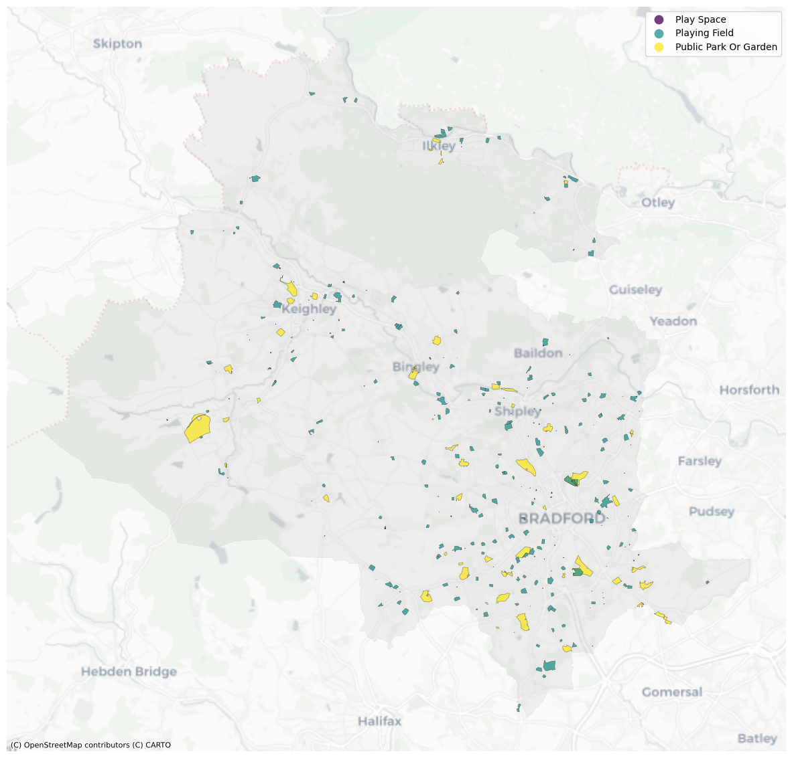
    


#### Figure 6.2.2. Count of greenspace by type within the Bradford LAD
<div style="color: #808080; margin-top: 5px">
    Data Source: OS, 2023; Author's calculations
</div>


```python
greenspace_types = Bradford_greenspace_site_unique['Type'].unique().tolist()     # Get list of greenspace types
greenspace_counts = list(Bradford_greenspace_site_unique['Type'].value_counts()) # Get list of greenspace type counts

colours = ['#21918c', '#440154', '#fde725']     # Set colours from the map for visual consistency

# Create a pie chart
fig, ax = plt.subplots()
wedges, labels = ax.pie(greenspace_counts, labels=greenspace_types,     # counts as data, types as labels
                        autopct=None, startangle=90,                    # turn off data labels, set start angle to 90degrees
                        wedgeprops=dict(width=0.5), colors=colours)     # set size of donut hole, set colour scheme

# Add labels within each pie piece
for label, value in zip(labels, greenspace_counts):
    label.set(size=10, text=f'{label.get_text()}: {value}')     # Set the labels to be "Type: Count"


# Equal aspect ratio to make sure the chart is drawn as a circle
ax.axis('equal')  

# Add a title
plt.title('Count of greenspace by type within the Bradford LAD',
          fontweight='bold', fontsize=12, fontfamily='sans-serif') # Change title to specified font settings

# Add a footnote with the data source and specify location on visual
plt.text(0.5, -0.15, "Data Source: OS, 2023; Author's calculations",
         ha="center", va="center", transform=plt.gca().transAxes,
         fontsize=8, color="gray")

# Display the pie chart
plt.show()
```


    

    


### 6.3. Deprivation

```python
def create_deprivation_choropleth(variable, final_df):
    # Create a copy of final_df so data and column names can be made visual-appropriate
    OA_choropleth = final_df.copy()
    
    # Multiply data by 100 to create percentage in readable format for the choropleth
    OA_choropleth[['HHD_dep_education_PC', 'HHD_dep_employment_PC', 
                   'HHD_dep_health_PC', 'HHD_dep_housing_PC']] = (
        OA_choropleth[['HHD_dep_education_PC', 'HHD_dep_employment_PC', 
                       'HHD_dep_health_PC', 'HHD_dep_housing_PC']] * 100).round(1)
    
    # Create a dictionary of current independent variable column names with long-form for use on map
    columns_dict = {"HHD_dep_education_PC": "Households deprived in the education dimension (%)",
                    "HHD_dep_employment_PC": "Households deprived in the employment dimension (%)",
                    "HHD_dep_health_PC": "Households deprived in the health dimension (%)",
                    "HHD_dep_housing_PC": "Households deprived in the housing dimension (%)"}
    
    # Rename the columns to the long-form version
    OA_choropleth.rename(columns=columns_dict, inplace=True)
    
    # Write long-form column name to a new variable to use in the choropleth code
    variable_longform = columns_dict[variable]

    # Plot choropleth
    fig, ax = plt.subplots(figsize=(15, 15))
    OA_choropleth.plot(column=variable_longform, 
                       ax=ax, 
                       scheme='EqualInterval', 
                       k=5, 
                       cmap='YlGnBu', 
                       legend=True)
    
    # Add basemap
    ctx.add_basemap(ax, crs=OA_choropleth.crs.to_string(), source=ctx.providers.CartoDB.Positron)

    # Customize plot
    ax.set_axis_off()
    
    # Add title to legend
    legend_title = variable_longform
    ax.get_legend().set_title(legend_title)

    # Show plot
    plt.show()
```

Figure 6.3.1. shows areas of high education deprivation in the southeast and west. Lowest levels are in rural, affluent areas in the southwest and north.

#### Figure 6.3.1. Percentage of households deprived in the education dimension by OA in Bradford LAD
<div style="color: #808080; margin-top: 5px">
    Data Source: ONS, 2023d; Author's calculations
</div>


```python
# Call the function with the desired variable and the dataframe
create_deprivation_choropleth('HHD_dep_education_PC', final_df)
```


    

    


Figure 6.3.2. shows similar spatial employment deprivation patterns to education. The range of employment deprivation is smaller though, from 0% to 54.7%.

#### Figure 6.3.2. Percentage of households deprived in the employment dimension by OA in Bradford LAD
<div style="color: #808080; margin-top: 5px">
    Data Source: ONS, 2023e; Author's calculations
</div>


```python
# Call the function with the desired variable and the dataframe
create_deprivation_choropleth('HHD_dep_employment_PC', final_df)
```


    
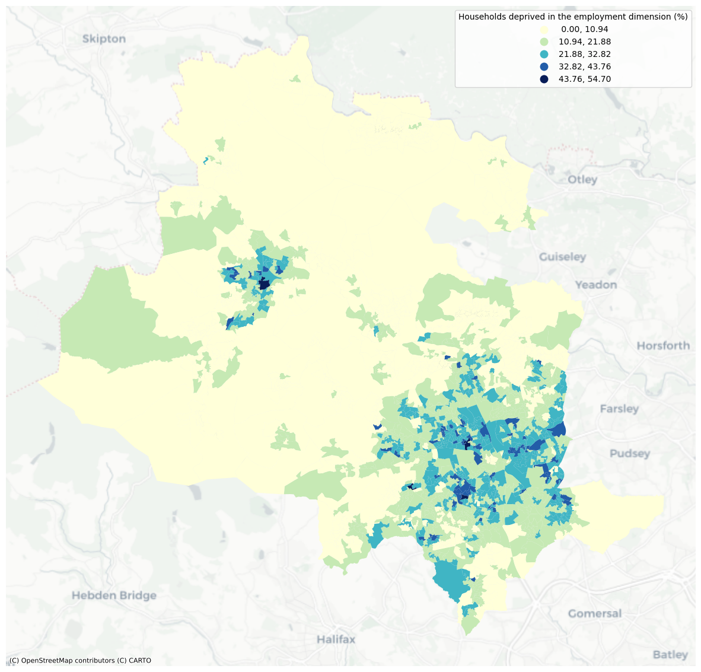
    


Figure 6.3.3. shows health deprivation levels are higher and widely spread. As health deprivation includes poor health and disability, levels may be higher due to factors including elderly populations, as well as affluence-associated poor health.

#### Figure 6.3.3. Percentage of households deprived in the health dimension by OA in Bradford LAD
<div style="color: #808080; margin-top: 5px">
    Data Source: ONS, 2023f; Author's calculations
</div>


```python
# Call the function with the desired variable and the dataframe
create_deprivation_choropleth('HHD_dep_health_PC', final_df)
```


    

    


Contrastingly, figure 6.3.4. shows housing deprivation is largely isolated to Bradford city and around Keighley. Most OAs have less than 10% housing deprivation.

#### Figure 6.3.4. Percentage of households deprived in the housing dimension by OA in Bradford LAD
<div style="color: #808080; margin-top: 5px">
    Data Source: ONS, 2023g; Author's calculations
</div>


```python
# Call the function with the desired variable and the dataframe
create_deprivation_choropleth('HHD_dep_housing_PC', final_df)
```


    
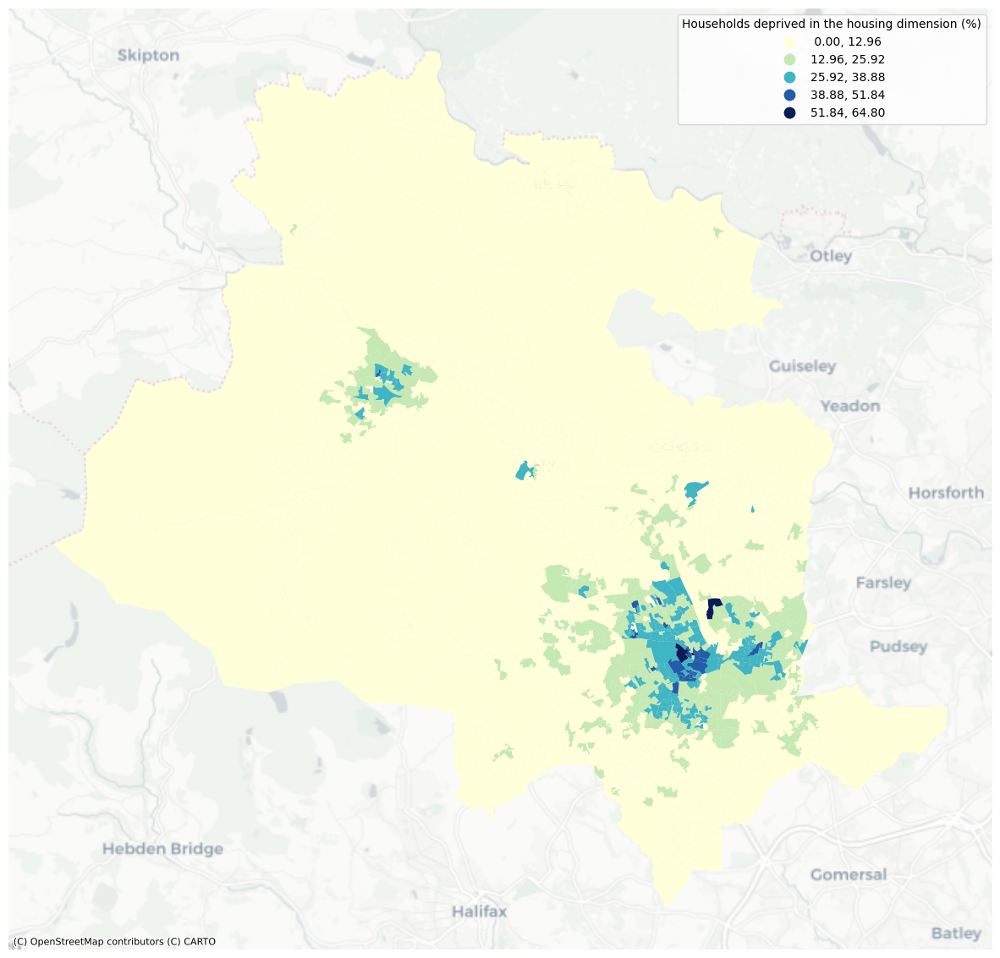
    


Figure 6.3.5. and 6.3.6. provide key summary statistics. Education deprivation has the largest range, from 2.2% in the least deprived OA to 67.8% in the most deprived. Only education and health dimensions exceed 0% in all OAs. For health, the lowest level of deprivation is 8.8% highlighting how even the most affluent areas are impacted by this.

Education, health, and housing have outliers at the higher end, recording maximum values around 65-68%. However, average deprivation levels vary across each dimension, with housing having the lowest average (11.0%) and health the highest (35.4%). There is no consistent distribution or spatial pattern to deprivation across all four dimensions.

#### Figure 6.3.5. Boxplots of the percentage of households deprived in the given dimension by OA in Bradford LAD
<div style="color: #808080; margin-top: 5px">
    Data Source: ONS, 2023d; ONS, 2023e; ONS, 2023f; ONS, 2023g; Author's calculations
</div>


```python
# Create a copy of the Ind_vars dataframe for the purposes of this boxplot
Ind_vars_boxplot = Ind_vars

# Multiply data by 100 to create percentage in readable format
Ind_vars_boxplot[['HHD_dep_education_PC', 'HHD_dep_employment_PC', 
                  'HHD_dep_health_PC', 'HHD_dep_housing_PC']] = (
    Ind_vars_boxplot[['HHD_dep_education_PC', 'HHD_dep_employment_PC', 
                      'HHD_dep_health_PC', 'HHD_dep_housing_PC']] * 100).round(1)

# Rename the columns for the chart to be clearer
Ind_vars_boxplot = Ind_vars_boxplot.rename(columns={
    "HHD_dep_education_PC": "Education",
    "HHD_dep_employment_PC": "Employment",
    "HHD_dep_health_PC": "Health",
    "HHD_dep_housing_PC": "Housing"})

# Setup figure and boxplot
fig, ax = plt.subplots(figsize=(10, 6))
wandering_forest_palette = ['#09435a', '#4e7d8e', '#9cc2b8', '#90958f']   # Create colour palette
sns.set_palette(wandering_forest_palette)     # Set colour palette
sns.boxplot(data=Ind_vars_boxplot)     # Add data

# Add title and amend axes
plt.title('Percentage of households deprived in the given dimension',
          fontweight='bold', fontsize=12) # Change title to specified font settings
plt.xlabel("Household deprivation dimension", fontweight='bold') # set x-axis label and font
plt.ylabel("Percentage of households deprived (%)", fontweight='bold') # set y-axis label and font

# Add a footnote with the data source and specify location on visual
plt.text(0.5, -0.15, "Data Source: ONS, 2023d; ONS, 2023e; ONS, 2023f; ONS, 2023g",
         ha="center", va="center", transform=plt.gca().transAxes,
         fontsize=8, color="gray")

plt.show()
```


    

    


#### Figure 6.3.6. Deprivation statistics in the given dimension by OA in Bradford LAD
<div style="color: #808080; margin-top: 5px">
    Data Source: ONS, 2023d; ONS, 2023e; ONS, 2023f; ONS, 2023g; Author's calculations
</div>


```python
# Get precise figures as shown in the boxplot
Ind_vars_boxplot.describe()
```


<table border="1" class="dataframe">
  <thead>
    <tr style="text-align: right;">
      <th></th>
      <th>Education</th>
      <th>Employment</th>
      <th>Health</th>
      <th>Housing</th>
    </tr>
  </thead>
  <tbody>
    <tr>
      <th>count</th>
      <td>1575.000000</td>
      <td>1575.000000</td>
      <td>1575.000000</td>
      <td>1575.000000</td>
    </tr>
    <tr>
      <th>mean</th>
      <td>24.954095</td>
      <td>15.573143</td>
      <td>35.444508</td>
      <td>10.959619</td>
    </tr>
    <tr>
      <th>std</th>
      <td>10.980256</td>
      <td>9.313979</td>
      <td>8.980795</td>
      <td>9.729166</td>
    </tr>
    <tr>
      <th>min</th>
      <td>2.200000</td>
      <td>0.000000</td>
      <td>8.800000</td>
      <td>0.000000</td>
    </tr>
    <tr>
      <th>25%</th>
      <td>16.900000</td>
      <td>8.000000</td>
      <td>29.100000</td>
      <td>3.900000</td>
    </tr>
    <tr>
      <th>50%</th>
      <td>23.900000</td>
      <td>13.800000</td>
      <td>34.800000</td>
      <td>7.600000</td>
    </tr>
    <tr>
      <th>75%</th>
      <td>31.600000</td>
      <td>22.000000</td>
      <td>41.000000</td>
      <td>15.150000</td>
    </tr>
    <tr>
      <th>max</th>
      <td>67.800000</td>
      <td>54.700000</td>
      <td>66.100000</td>
      <td>64.800000</td>
    </tr>
  </tbody>
</table>
</div>


### 6.4. Distance to nearest greenspace
Figure 6.4.1. shows distances to greenspace are greater in rural areas to the north and west. These areas are more affluent, with lower levels of deprivation (figures 6.3.1.-6.3.4). More deprived OAs have lower distances.

#### Figure 6.4.1. Distance to nearest greenspace (metres) by OA in Bradford LAD
<div style="color: #808080; margin-top: 5px">
    Data Source: ONS, 2023b; OS, 2023; Author's calculations
</div>


```python
def create_distance_choropleth(final_df):
    # Create a copy of final_df so data and column names can be made visual-appropriate
    OA_dist_choropleth = final_df.copy()
    
    # Round distance to the nearest metre
    OA_dist_choropleth['Distance'] = OA_dist_choropleth['Distance'].round().astype(int)
    
    # Create a dictionary of current distance column name with long-form for use on map
    distance_dict = {"Distance": "Distance to nearest greenspace (metres)"}
    
    # Rename the column to the long-form version
    rename_column = OA_dist_choropleth.rename(columns=distance_dict, inplace=True)
    
    # Write long-form column name to a new variable to use in the choropleth code
    distance_longform = 'Distance to nearest greenspace (metres)'

    # Plot choropleth
    fig, ax = plt.subplots(figsize=(15, 15))
    OA_dist_choropleth.plot(column=distance_longform, 
                            ax=ax, 
                            scheme='NaturalBreaks', 
                            cmap='YlGnBu', 
                            legend=True)
    
    # Add basemap
    ctx.add_basemap(ax, crs=OA_dist_choropleth.crs.to_string(), source=ctx.providers.CartoDB.Positron)

    # Customize plot
    ax.set_axis_off()
    
    # Add title to legend
    ax.get_legend().set_title(distance_longform)

    # Show plot
    plt.show()
```


```python
# Call the function with the DataFrame final_df
create_distance_choropleth(final_df)
```


    
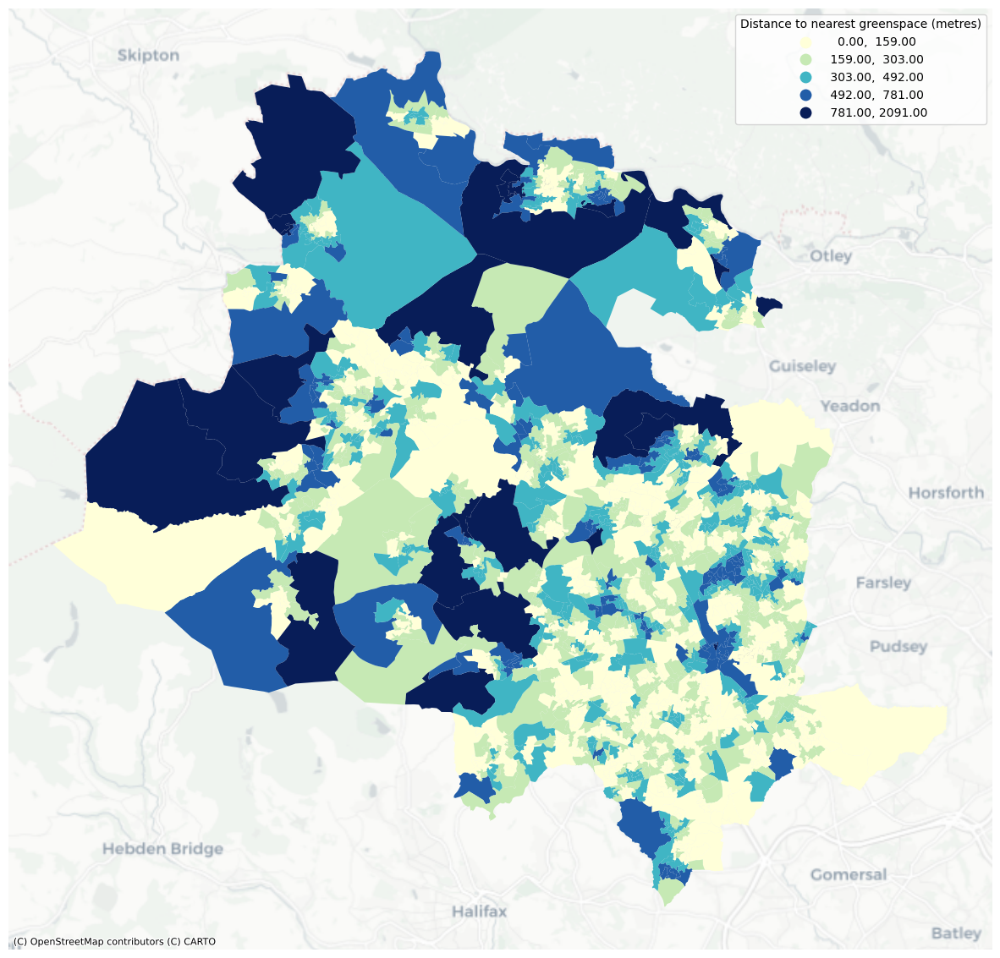
    


Figure 6.4.2. shows outliers at larger distances, confirming the distance variable is right skewed. Meanwhile, figure 6.4.3. shows the range, from 0m to over 2,000m. OAs with 0m distance are a result of PWCs falling within greenspace boundaries. On average, greenspace is around 275m from PWCs, which is below the previous UK government target of 300m (Houlden et al, 2019).

#### Figure 6.4.2. Boxplot of distance to nearest greenspace (metres) by OA in Bradford LAD
<div style="color: #808080; margin-top: 5px">
    Data Source: ONS, 2023b; OS, 2023; Author's calculations
</div>


```python
# Setup figure and boxplot
fig, ax = plt.subplots(figsize=(10, 6))
sns.boxplot(unique_nearest_greenspace, x='Distance', color='#e1fdd5')     # Add data and change colour

# Add title and amend axes
plt.title('Distance to nearest greenspace by OA in Bradford',
          fontweight='bold', fontsize=12) # Change title to specified font settings
ax.set(xlabel="") # Set ax xlabel to nothing so the variable name does not appear
plt.xlabel("Distance to nearest greenspace (metres)", fontweight='bold') # set x-axis label and font
plt.ylabel("OAs", fontweight='bold') # set y-axis label and font

# Set the x-axis ticks at 250 increments
tick_locations = np.arange(0, 2251, 250)
ax.set_xticks(tick_locations)

# Add a footnote with the data source and specify location on visual
plt.text(0.5, -0.15, "Data Source: ONS, 2023b; OS, 2023; Author's calculations",
         ha="center", va="center", transform=plt.gca().transAxes,
         fontsize=8, color="gray")

plt.show()
```


    

    


#### Figure 6.4.3. Distance to nearest greenspace (metres) statistics by OA in Bradford LAD
<div style="color: #808080; margin-top: 5px">
    Data Source: ONS, 2023b; OS, 2023; Author's calculations
</div>


```python
# Get precise figures as shown in the boxplot
unique_nearest_greenspace.describe()
```


<table border="1" class="dataframe">
  <thead>
    <tr style="text-align: right;">
      <th></th>
      <th>Distance</th>
    </tr>
  </thead>
  <tbody>
    <tr>
      <th>count</th>
      <td>1575.000000</td>
    </tr>
    <tr>
      <th>mean</th>
      <td>247.661399</td>
    </tr>
    <tr>
      <th>std</th>
      <td>183.485184</td>
    </tr>
    <tr>
      <th>min</th>
      <td>0.000000</td>
    </tr>
    <tr>
      <th>25%</th>
      <td>119.213902</td>
    </tr>
    <tr>
      <th>50%</th>
      <td>201.468622</td>
    </tr>
    <tr>
      <th>75%</th>
      <td>332.656088</td>
    </tr>
    <tr>
      <th>max</th>
      <td>2090.986345</td>
    </tr>
  </tbody>
</table>
</div>


### 6.5. Dependent and independent variables
Figure 6.5.1. shows scatter plots and regression lines between the dependent and independent variables. There is one high distance outlier visible across all four dimensions, and all present a negative correlation with distance to nearest greenspace.

#### Figure 6.5.1. Scatterplots of distance to nearest greenspace (metres) and household deprivation dimensions, by OA in Bradford LAD
<div style="color: #808080; margin-top: 5px">
    Data Source: ONS, 2023b; ONS, 2023d; ONS, 2023e; ONS, 2023f; ONS, 2023g; OS, 2023; Author's calculations
</div>


```python
# Set up a figure with 2 rows and 2 columns for subplots
fig, axs = plt.subplots(2, 2, figsize=(15, 10), sharey=True, sharex=True) # Share axes across 4 plots for visual consistency

# Add title, x-axis subtitle, and y-axis labels
plt.title('Distance to nearest greenspace compared to Household Deprivation Dimensions', 
          x=-0.15, y=2.25, fontweight='bold', fontsize=12)
fig.suptitle('Household Deprivation Dimension', y=0.05, fontweight='bold', fontsize=12)
axs[0,0].set_ylabel('Distance to nearest greenspace (metres)', fontweight='bold', fontsize=12)
axs[1,0].set_ylabel('Distance to nearest greenspace (metres)', fontweight='bold', fontsize=12)


### Education scatter
axs[0,0].scatter(x=final_df['HHD_dep_education_PC'], y=final_df['Distance'], s=3, c='#09435a') # add data and set colour
axs[0,0].set_xlabel('Education (%)', fontsize=12) # add axis label and set font

# Calculate the regression line
slope0, intercept0 = np.polyfit(final_df['HHD_dep_education_PC'], final_df['Distance'], 1)
regression_line0 = np.polyval([slope0, intercept0], final_df['HHD_dep_education_PC'])

# Add this to the chart
axs[0,0].plot(final_df['HHD_dep_education_PC'], regression_line0, color='red')


### Employment scatter
axs[0,1].scatter(x=final_df['HHD_dep_employment_PC'], y=final_df['Distance'], s=3, c='#4e7d8e') # add data and set colour
axs[0,1].set_xlabel('Employment (%)', fontsize=12) # add axis label and set font

# Calculate the regression line
slope1, intercept1 = np.polyfit(final_df['HHD_dep_employment_PC'], final_df['Distance'], 1)
regression_line1 = np.polyval([slope1, intercept1], final_df['HHD_dep_employment_PC'])

# Add this to the chart
axs[0,1].plot(final_df['HHD_dep_employment_PC'], regression_line1, color='red')


### Health scatter
axs[1,0].scatter(x=final_df['HHD_dep_health_PC'], y=final_df['Distance'], s=3, c='#9cc2b8') # add data and set colour
axs[1,0].set_xlabel('Health (%)', fontsize=12) # add axis label and set font

# Calculate the regression line
slope2, intercept2 = np.polyfit(final_df['HHD_dep_health_PC'], final_df['Distance'], 1)
regression_line2 = np.polyval([slope2, intercept2], final_df['HHD_dep_health_PC'])

# Add this to the chart
axs[1,0].plot(final_df['HHD_dep_health_PC'], regression_line2, color='red')


### Housing scatter
axs[1,1].scatter(x=final_df['HHD_dep_housing_PC'], y=final_df['Distance'], s=3, c='#90958f') # add data and set colour
axs[1,1].set_xlabel('Housing (%)', fontsize=12) # add axis label and set font

# Calculate the regression line
slope3, intercept3 = np.polyfit(final_df['HHD_dep_housing_PC'], final_df['Distance'], 1)
regression_line3 = np.polyval([slope3, intercept3], final_df['HHD_dep_housing_PC'])

# Add this to the chart
axs[1,1].plot(final_df['HHD_dep_housing_PC'], regression_line3, color='red')


# Add a footnote with the data source and specify location on visual
plt.text(-0.15, -0.3,
         "Data Source: ONS, 2023b; ONS, 2023d; ONS, 2023e; ONS, 2023f; ONS, 2023g; OS, 2023; Author's calculations",
         ha="center", va="center", transform=plt.gca().transAxes,
         fontsize=10, color="gray")


plt.show()
```


    

    


## 7. Analysis and results
### 7.1. OLS Regression
Checks for collinearity are conducted using a correlation matrix (figure 7.1.1.). Deprivation variables have a positive correlation with one another, particularly employment and health. Figure 7.1.2. is a coefficient matrix which confirms that the employment and health dimensions have a coefficient of 0.68 which is high and could indicate collinearity. People with poorer health or disabilities are more likely to be out of work (ONS, 2023i) and so, coupled with the high coefficient, it has been determined that collinearity is present between these variables.

#### Figure 7.1.1. Correlation matrix of independent and dependent variables by OA in Bradford LAD
<div style="color: #808080; margin-top: 5px">
    Data Source: ONS, 2023b; ONS, 2023d; ONS, 2023e; ONS, 2023f; ONS, 2023g; OS, 2023; Author's calculations
</div>


```python
# Initial correlations to check for collinearity
output = pd.plotting.scatter_matrix(final_df, alpha=0.2, figsize=(12, 12), diagonal='kde')
```


    
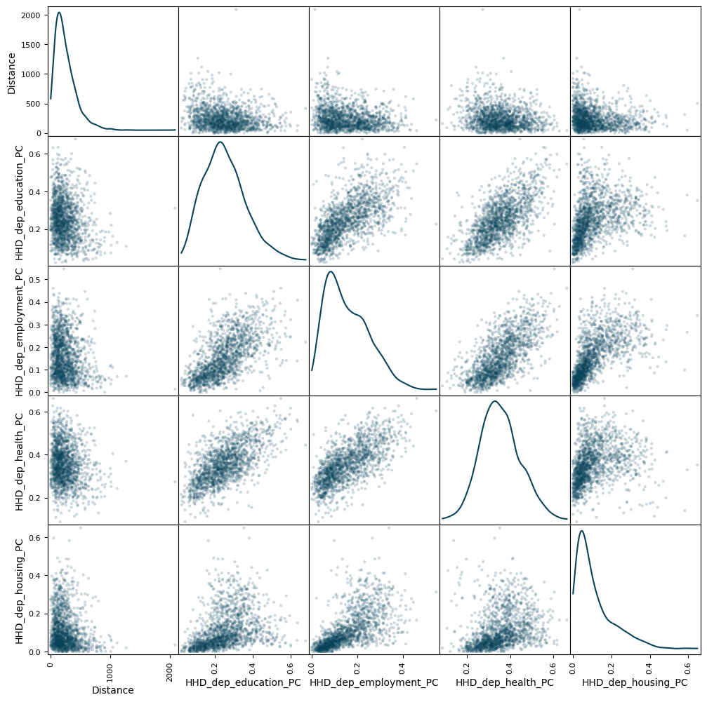
    


#### Figure 7.1.2. Coefficient matrix of independent and dependent variables by OA in Bradford LAD
<div style="color: #808080; margin-top: 5px">
    Data Source: ONS, 2023b; ONS, 2023d; ONS, 2023e; ONS, 2023f; ONS, 2023g; OS, 2023; Author's calculations
</div>


```python
# Correlation coefficient matrix
final_df.corr(numeric_only=True)
```


<table border="1" class="dataframe">
  <thead>
    <tr style="text-align: right;">
      <th></th>
      <th>Distance</th>
      <th>HHD_dep_education_PC</th>
      <th>HHD_dep_employment_PC</th>
      <th>HHD_dep_health_PC</th>
      <th>HHD_dep_housing_PC</th>
    </tr>
  </thead>
  <tbody>
    <tr>
      <th>Distance</th>
      <td>1.000000</td>
      <td>-0.182102</td>
      <td>-0.181204</td>
      <td>-0.160042</td>
      <td>-0.148355</td>
    </tr>
    <tr>
      <th>HHD_dep_education_PC</th>
      <td>-0.182102</td>
      <td>1.000000</td>
      <td>0.620664</td>
      <td>0.643816</td>
      <td>0.358545</td>
    </tr>
    <tr>
      <th>HHD_dep_employment_PC</th>
      <td>-0.181204</td>
      <td>0.620664</td>
      <td>1.000000</td>
      <td>0.680197</td>
      <td>0.624160</td>
    </tr>
    <tr>
      <th>HHD_dep_health_PC</th>
      <td>-0.160042</td>
      <td>0.643816</td>
      <td>0.680197</td>
      <td>1.000000</td>
      <td>0.272581</td>
    </tr>
    <tr>
      <th>HHD_dep_housing_PC</th>
      <td>-0.148355</td>
      <td>0.358545</td>
      <td>0.624160</td>
      <td>0.272581</td>
      <td>1.000000</td>
    </tr>
  </tbody>
</table>
</div>


#### Addressing collinearity
Figure 7.1.3. shows the p-value for employment is highest, meaning it is the least statistically significant variable, so employment is removed to eliminate the identified collinearity.


```python
# Create the independent Y variable
y = final_df['Distance']

# Create the dependent X variables
X = final_df[['HHD_dep_education_PC','HHD_dep_employment_PC','HHD_dep_health_PC','HHD_dep_housing_PC']]

# Add the constant
x1 = sm.add_constant(X)
```


```python
# Create OLS regression model
mod = sm.OLS(y, x1)
```


```python
# Fit the model and save results
results = mod.fit()
```

#### Figure 7.1.3. Results of OLS model including all four deprivation dimensions
<div style="color: #808080; margin-top: 5px">
    Data Source: ONS, 2023b; ONS, 2023d; ONS, 2023e; ONS, 2023f; ONS, 2023g; OS, 2023; Author's calculations
</div>


```python
# Print results summary
print(results.summary())
```

                                OLS Regression Results                            
    ==============================================================================
    Dep. Variable:               Distance   R-squared:                       0.044
    Model:                            OLS   Adj. R-squared:                  0.042
    Method:                 Least Squares   F-statistic:                     18.13
    Date:                Mon, 13 May 2024   Prob (F-statistic):           1.43e-14
    Time:                        19:16:44   Log-Likelihood:                -10408.
    No. Observations:                1575   AIC:                         2.083e+04
    Df Residuals:                    1570   BIC:                         2.085e+04
    Df Model:                           4                                         
    Covariance Type:            nonrobust                                         
    =========================================================================================
                                coef    std err          t      P>|t|      [0.025      0.975]
    -----------------------------------------------------------------------------------------
    const                   351.9268     20.166     17.452      0.000     312.373     391.481
    HHD_dep_education_PC   -165.8278     57.102     -2.904      0.004    -277.831     -53.824
    HHD_dep_employment_PC   -78.8281     86.937     -0.907      0.365    -249.352      91.696
    HHD_dep_health_PC       -99.3122     77.368     -1.284      0.199    -251.068      52.443
    HHD_dep_housing_PC     -140.5889     61.893     -2.271      0.023    -261.991     -19.187
    ==============================================================================
    Omnibus:                      685.269   Durbin-Watson:                   1.660
    Prob(Omnibus):                  0.000   Jarque-Bera (JB):             5645.947
    Skew:                           1.830   Prob(JB):                         0.00
    Kurtosis:                      11.523   Cond. No.                         26.7
    ==============================================================================
    
    Notes:
    [1] Standard Errors assume that the covariance matrix of the errors is correctly specified.
    

#### OLS regression model
The model includes education, health, and housing deprivation dimensions. Figure 7.1.4. shows that all three are statistically significant at the 95% confidence level. The model has an R-squared value of 0.044, meaning only 4.4% of variance is accounted for. Further analysis of the residuals is warranted.


```python
# Create the independent Y variable
y = final_df['Distance']

# Create the dependent X variables
X = final_df[['HHD_dep_education_PC','HHD_dep_health_PC','HHD_dep_housing_PC']]

# Add the constant
x1 = sm.add_constant(X)
```


```python
# Create OLS regression model
mod = sm.OLS(y, x1)
```


```python
# Fit the model and save results
results = mod.fit()
```

<div style="color: #2F5496; font-size: 14px; font-weight: bold;">
    Figure 7.1.4. Results of OLS model including education, health, and housing deprivation dimensions
</div>

<div style="color: #808080; margin-top: 5px">
    Data Source: ONS, 2023b; ONS, 2023d; ONS, 2023f; ONS, 2023g; OS, 2023; Author's calculations
</div>


```python
# Print results summary
print(results.summary())
```

                                OLS Regression Results                            
    ==============================================================================
    Dep. Variable:               Distance   R-squared:                       0.044
    Model:                            OLS   Adj. R-squared:                  0.042
    Method:                 Least Squares   F-statistic:                     23.91
    Date:                Mon, 13 May 2024   Prob (F-statistic):           3.95e-15
    Time:                        19:16:44   Log-Likelihood:                -10408.
    No. Observations:                1575   AIC:                         2.082e+04
    Df Residuals:                    1571   BIC:                         2.085e+04
    Df Model:                           3                                         
    Covariance Type:            nonrobust                                         
    ========================================================================================
                               coef    std err          t      P>|t|      [0.025      0.975]
    ----------------------------------------------------------------------------------------
    const                  359.1799     18.510     19.405      0.000     322.873     395.487
    HHD_dep_education_PC  -177.5110     55.626     -3.191      0.001    -286.620     -68.402
    HHD_dep_health_PC     -135.9300     65.988     -2.060      0.040    -265.364      -6.496
    HHD_dep_housing_PC    -173.7491     49.930     -3.480      0.001    -271.686     -75.812
    ==============================================================================
    Omnibus:                      689.258   Durbin-Watson:                   1.658
    Prob(Omnibus):                  0.000   Jarque-Bera (JB):             5763.638
    Skew:                           1.837   Prob(JB):                         0.00
    Kurtosis:                      11.621   Cond. No.                         19.1
    ==============================================================================
    
    Notes:
    [1] Standard Errors assume that the covariance matrix of the errors is correctly specified.
    

<div style="color: #2F5496; font-size: 14px; font-weight: bold;">
    Analysis of observed versus fitted values and residuals
</div>


```python
# Obtain residuals from results
residuals = results.resid
```


```python
# Creating a DataFrame with 'OA21CD' and residuals
residuals_data = pd.DataFrame({
    'OA21CD': final_df['OA21CD'],
    'Residuals': residuals
})

# Add Residuals to final_df
final_df = pd.merge(final_df, residuals_data, on='OA21CD')
```

Figure 7.1.5. illustrates the relationship between the observed distances and fitted values from the model. There is an outlier – the largest distance in the observed values is no longer the largest in the fitted values – and fitted values have a much smaller range with the largest distance being closer to 325m.

#### Figure 7.1.5. Observed vs Fitted Values for the OLS regression model
<div style="color: #808080; margin-top: 5px">
    Data Source: Author's calculations
</div>


```python
# Set up a figure
fig, ax = plt.subplots(figsize=(10, 6))

# Set axis labels and title
plt.xlabel('Fitted values - Distance (metres)', fontweight='bold', fontsize=12)
plt.ylabel('Observed values - Distance (metres)', fontweight='bold', fontsize=12)
plt.title('Observed vs Fitted Values for the OLS regression model', fontweight='bold')

# Scatter plot showing Fitted against Observed values
plt.scatter(x=results.fittedvalues, y=y, label='Data', s=3, c='#09435a') # add data and set colour and size of circles

# Plot the line y=x
plt.plot([min(results.fittedvalues), max(results.fittedvalues)],
         [min(results.fittedvalues), max(results.fittedvalues)], linestyle='--', color='red', label='y=x')


# Set the y-axis ticks at 250 increments
tick_locations = np.arange(0, 2251, 250)
ax.set_yticks(tick_locations)

# Add legend
plt.legend()

plt.show()
```


    
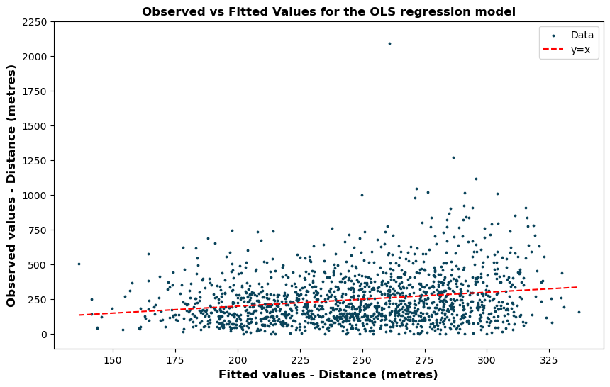
    


Figure 7.1.6. shows the variance in the residuals. No distinct relationship is visible with positive and negative residuals ranging from around -250 to +250, across all fitted distance values. This suggests the assumption that the relationship is linear is reasonable, and the variance of the error terms are equal. However, only larger positive residuals exist, meaning the model is not working as well for largest distances in the observed values.

#### Figure 7.1.6. Residuals vs Fitted Values for the OLS regression model
<div style="color: #808080; margin-top: 5px">
    Data Source: Author's calculations
</div>


```python
# Set up a figure
fig, ax = plt.subplots(figsize=(10, 6))

# Set axis labels and title
plt.xlabel('Fitted values - Distance (metres)', fontweight='bold', fontsize=12)
plt.ylabel('Residuals', fontweight='bold', fontsize=12)
plt.title('Residuals vs Fitted Values for the OLS regression model', fontweight='bold')

# Scatter plot showing Fitted values against Residuals
plt.scatter(x=results.fittedvalues, y=final_df['Residuals'], label='Data', s=3, c='#09435a') # add data and set colour/size

# Add dashed horizontal line at y=0
plt.axhline(0, linestyle='--', color='black', linewidth=0.8)

# Set the x-axis ticks at 250 increments
tick_locations = np.arange(-250, 2001, 250)
ax.set_yticks(tick_locations)

plt.show()
```


    

    


To confirm this, figure 7.1.6. shows a histogram of the residuals, highlighting a normal distribution centred around 0, with a slight right skew.

#### Figure 7.1.7. Histogram of residuals for the OLS regression model
<div style="color: #808080; margin-top: 5px">
    Data Source: Author's calculations
</div>


```python
# Set up a figure
fig, ax = plt.subplots(figsize=(10, 6))

# Plot histogram of residuals
sns.histplot(x=residuals, bins=50, ax=ax)

# Set the x-axis ticks at 250 increments
tick_locations = np.arange(-250, 2001, 250)
ax.set_xticks(tick_locations)

# Label axes
ax.set_xlabel('Residuals', fontweight='bold')
ax.set_ylabel('Count', fontweight='bold')

# Title and show the plot
plt.title('Histogram of Residuals from OLS model', fontweight='bold', fontsize=12)
plt.show()
```


    
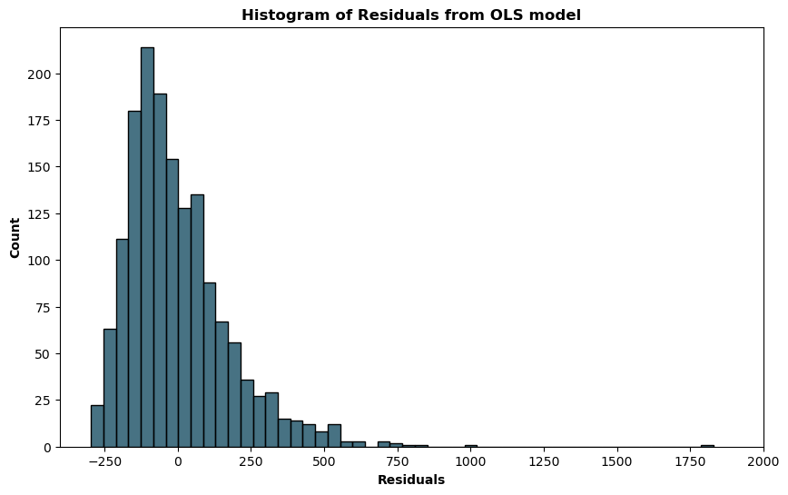
    


Lastly, a Q-Q plot is used to confirm the presence of outliers. One extreme outlier was visible in the previous charts, but a Q-Q plot allows for confirmation of other outliers closer to the rest of the data points. Figure 7.1.8. confirms that there are outliers in the residuals at both the top and bottom end.

#### Figure 7.1.8. Q-Q Plot
<div style="color: #808080; margin-top: 5px">
    Data Source: Author's calculations
</div>


```python
# Create a figure and axis
fig, ax = plt.subplots(figsize=(10, 6))

# Create a Q-Q plot
probplot(residuals, dist="norm", plot=plt)

# Add title and label axes
plt.title("Q-Q Plot", fontweight='bold')
plt.xlabel("Theoretical Quantiles", fontweight='bold')
plt.ylabel("Ordered Values", fontweight='bold')

# Change colour of circles
ax.lines[0].set_markerfacecolor('#4e7d8e')
ax.lines[0].set_markeredgecolor('#4e7d8e')

plt.show()
```


    
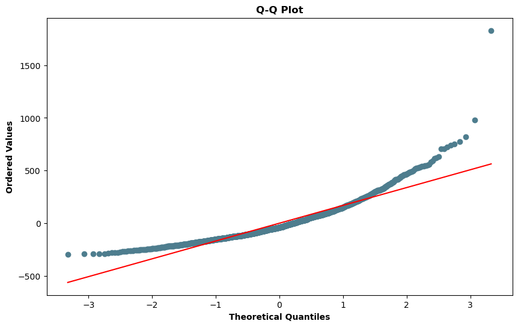
    


### 7.2. Moran's I
Moran's I is used to detect high and low values concentrated spatially, and the spatial relationship between neighbours is random if zero association is found (Paez and Scott, 2004). Queens weights are used, meaning any OA bordering the given OA is included.

The I value is 0.46 and the p-value is 0.001. These are positive and significant respectively, implying distance to nearest greenspace is spatially correlated - higher values and lower values cluster spatially. Figure 7.2.1. shows this on a scatterplot.


```python
# Calculate the queen weights based on the OA
w_queen = weights.Queen.from_dataframe(final_df, ids = 'OA21CD')
```


```python
# Calculate Moran's I using queen weights
mi = esda.Moran(final_df['Distance'], w_queen)
```


```python
# I value
print(f'I value: {mi.I}')

# Significance (p value)
print(f'P value: {mi.p_sim}')
```

|    I value    | 0.45882055605281585    |
|:-------------:|:----------------------:|
|    P value    | 0.001                  |
    

#### Figure 7.2.1. Moran Scatterplot
<div style="color: #808080; margin-top: 5px">
    Data Source: Author's calculations
</div>


```python
fig, ax = plt.subplots(figsize=(9, 9))  # Set figure size
moran_scatterplot(mi, ax=ax)  # Create Moran's I scatterplot

# Change the color and size of points
scatter_plot = ax.get_children()[0]
scatter_plot.set_facecolor('#09435a')
scatter_plot.set_edgecolor('#09435a')
scatter_plot.set_sizes([10])

# Show the plot
plt.show()
```


    

    


To minimise outlier impact, the distance value for this OA will be reduced to the second highest value.


```python
# Find maximum distance
final_df['Distance'].max()
```


2090.9863451326555


```python
# Find the second highest distance
final_df[final_df['Distance'] < final_df['Distance'].max()]['Distance'].max()
```


1268.1070267044204


```python
distance_sort = final_df.Distance.tolist() # Create a list of distances
distance_sort.remove(max(distance_sort)) # Remove maximum value
# Set the new max (second highest)
final_df['Distance_Clean'] = final_df.Distance #create a new column
final_df.loc[final_df['Distance']>1500, 'Distance_Clean'] = max(distance_sort) 
# If the distance is greater than 1500 in the original variable, set it equal to the maximum value of our cleaned variable
# Use 1500 as a buffer to the actual 2nd highest distance shown in the previous cell
```


```python
# Check new max is expected value
print(final_df['Distance_Clean'].max())
print(final_df['Distance_Clean'].max() == final_df[final_df['Distance'] < final_df['Distance'].max()]['Distance'].max())
```

1268.1070267044204

True
    

Moran's I is re-calculated and the I value is now 0.47, and the p-value remains 0.001. These results are still positive and significant respectively, so distance to nearest greenspace remains spatially correlated. Figure 7.2.2. shows the outlier is removed.


```python
# Calculate new Moran's I using queen weights and cleaned Distance variable
mi_adj = esda.Moran(final_df['Distance_Clean'], w_queen)
```


```python
# I value
print(f'I value: {mi_adj.I}')

# Significance (p value)
print(f'P value: {mi_adj.p_sim}')
```

|    I value    | 0.47144858850487537    |
|:-------------:|:----------------------:|
|    P value    | 0.001                  |
    

#### Figure 7.2.2. Moran Scatterplot (Adjusted)
<div style="color: #808080; margin-top: 5px">
    Data Source: Author's calculations
</div>


```python
fig, ax = plt.subplots(figsize=(9, 9))  # Set figure size
moran_scatterplot(mi_adj, ax=ax)  # Create Moran's I scatterplot

# Change the color and size of points
scatter_plot = ax.get_children()[0]
scatter_plot.set_facecolor('#09435a')
scatter_plot.set_edgecolor('#09435a')
scatter_plot.set_sizes([10])

# Show the plot
plt.show()
```


    
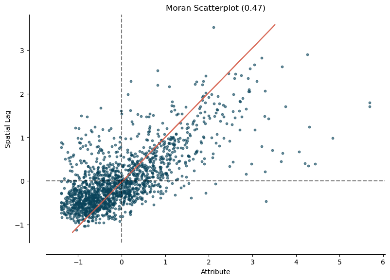
    


### 7.3. LISA Clusters
Spatial association will be tested and visualised using Local Indicators of Spatial Association (LISA) clusters. This will be conducted on the dependent variable and residuals from Section 7.1.

#### Distance
Significance is calculated to the 95% level and a LISA cluster assigned. Figure 7.3.1. shows each LISA cluster, with clear spatial patterns emerging. To the north and south, and north of Bradford city centre, there are High-High clusters, meaning these OAs have high distances to the nearest greenspace as do their neighbouring OAs. Meanwhile, Low-Low clusters can be observed around the city of Bradford suburbs and Keighley town centre.


```python
# Calculate LISA clusters
lisa_Distance = esda.Moran_Local(final_df['Distance_Clean'], w_queen)
```


```python
final_df['Sig_Distance'] = lisa_Distance.p_sim < 0.05 # Calculate a variable to show which are significant at the 95% level
final_df['Quad_Distance'] = lisa_Distance.q # Calculate a variable indicating the respective quadrant
```


```python
# Create categorical column for the map visual
final_df['LISA_Distance'] = np.select(
    [
        (final_df['Sig_Distance'] == False),
        (final_df['Sig_Distance'] == True) & (final_df['Quad_Distance'] == 1),
        (final_df['Sig_Distance'] == True) & (final_df['Quad_Distance'] == 2),
        (final_df['Sig_Distance'] == True) & (final_df['Quad_Distance'] == 3),
        (final_df['Sig_Distance'] == True) & (final_df['Quad_Distance'] == 4)
    ],
    [
        'Not Significant',
        'High-High',
        'Low-High',
        'Low-Low',
        'High-Low'
    ],
    default='ERROR'  # Return "ERROR" string if conditions above are not met
)
```

#### Figure 7.3.1. Map of distance LISA Clusters by OA in Bradford LAD
<div style="color: #808080; margin-top: 5px">
    Data Source: Author's calculations
</div>


```python
custom_cmap = mcolors.ListedColormap(['#E14D2A','#FACF5A','#4F9DA6','#233142','lightGrey'])

fig, ax = plt.subplots(figsize=(15, 15))
final_df.plot(column='LISA_Distance', 
              ax=ax, 
              categorical=True,
              legend=True, 
              cmap=custom_cmap)

# Add basemap
ctx.add_basemap(ax, crs=final_df.crs.to_string(), source=ctx.providers.CartoDB.Positron)

# Customize plot
ax.set_axis_off()

# Show plot
plt.show()
```


    

    


#### Residuals
Figure 7.3.2. shows similar spatial patterns for the residual LISA clusters. There is one noticeable OA to the north that is Low-High - this OA has a small residual error compared to neighbouring OAs – and fewer Low-High clusters in central areas. Despite these differences, spatial association is still present across much of the district.


```python
# Calculate LISA clusters
lisa_Residuals = esda.Moran_Local(final_df['Residuals'], w_queen)
```


```python
final_df['Sig_Residuals'] = lisa_Residuals.p_sim < 0.05 # Calculate a variable to show which are significant at the 95% level
final_df['Quad_Residuals'] = lisa_Residuals.q # Calculate a variable indicating the respective quadrant
```


```python
# Create categorical column for the map visual
final_df['LISA_Residuals'] = np.select(                                           # Select rows meeting following rules
    [
        (final_df['Sig_Residuals'] == False),                                     # Not significant
        (final_df['Sig_Residuals'] == True) & (final_df['Quad_Residuals'] == 1),  # Significant and Quadrant 1
        (final_df['Sig_Residuals'] == True) & (final_df['Quad_Residuals'] == 2),  # Significant and Quadrant 2
        (final_df['Sig_Residuals'] == True) & (final_df['Quad_Residuals'] == 3),  # Significant and Quadrant 3
        (final_df['Sig_Residuals'] == True) & (final_df['Quad_Residuals'] == 4)   # Significant and Quadrant 4
    ],
    [
        'Not Significant',                                                        # Assign string based on above rules
        'High-High',
        'Low-High',
        'Low-Low',
        'High-Low'
    ],
    default='ERROR'  # Return "ERROR" string if conditions above are not met
)
```

#### Figure 7.3.2. Map of residual LISA Clusters by OA in Bradford LAD
<div style="color: #808080; margin-top: 5px">
    Data Source: Author's calculations
</div>


```python
fig, ax = plt.subplots(figsize=(15, 15))

custom_cmap = mcolors.ListedColormap(['#E14D2A','#FACF5A','#4F9DA6','#233142','lightGrey'])

# Plot choropleth map
final_df.plot(column='LISA_Residuals', 
              ax=ax, 
              categorical=True,
              legend=True, 
              cmap=custom_cmap)

# Add basemap
ctx.add_basemap(ax, crs=final_df.crs.to_string(), source=ctx.providers.CartoDB.Positron)

# Customize plot
ax.set_axis_off()

# Add title to legend
ax.get_legend().set_title('LISA Clusters for Residuals')

# Show plot
plt.show()
```


    
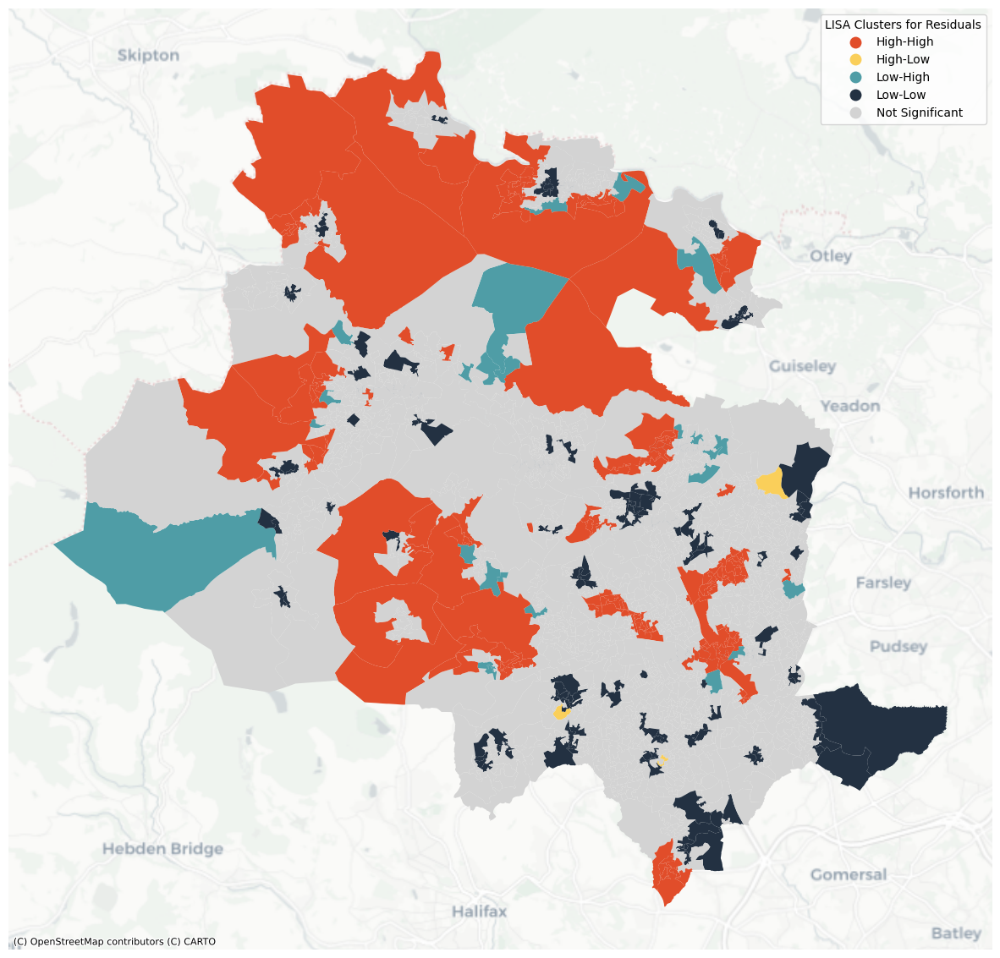
    


Results from the Moran's I and LISA cluster analysis confirms a Geographically Weighted Regression (GWR) model is required to ensure spatial association is considered.

### 7.4. GWR model
Bandwidth is the optimal number of datapoints that will be included in each local regression model. The bandwidth calculated is 54.0 – the 54 nearest datapoints of the 1,575 OAs in the dataset will be included, hence each local model will be using roughly 3% of the available data.


```python
# Split the geometry into X and Y columns
Bradford_OA_PWC_tidy['X'] = Bradford_OA_PWC_tidy['geometry'].x
Bradford_OA_PWC_tidy['Y'] = Bradford_OA_PWC_tidy['geometry'].y
```


```python
# Add this to the final_df
final_df = final_df.merge(Bradford_OA_PWC_tidy, how='inner', on='OA21CD').drop(['geometry'], axis=1)
```


```python
g_coords = list(zip(final_df.X, final_df.Y)) # Create a list of x and y coordinates

# Create y variable
g_y = np.asarray(final_df.Distance_Clean).reshape((-1,1))

# Create x variables
g_X = final_df[['HHD_dep_education_PC', 'HHD_dep_health_PC', 'HHD_dep_housing_PC']]
g_X = np.asarray(g_X)

gwr_selector = Sel_BW(g_coords, g_y, g_X) #set parameters for calculating the bandwidth
```


```python
# Calculate optimised bandwidth
bw = gwr_selector.search()
print(bw)
```

54.0
    

The GWR model (figure 7.4.1) includes global regression results reflecting the OLS model (section 7.1), whilst GWR results give details of the local models. The R-squared value is 0.458 (45.8% of variance is accounted for) which is higher than the global regression model.


```python
# Create GWR model
gwr = GWR(g_coords, g_y, g_X, bw)

# Fit the model
gwr_results = gwr.fit()
```

#### Figure 7.4.1. Results of GWR model
<div style="color: #808080; margin-top: 5px">
    Data Source: Author's calculations
</div>


```python
# View results summary
print(gwr_results.summary())
```

    ===========================================================================
    Model type                                                         Gaussian
    Number of observations:                                                1575
    Number of covariates:                                                     4
    
    Global Regression Results
    ---------------------------------------------------------------------------
    Residual sum of squares:                                       48341131.294
    Log-likelihood:                                                  -10371.107
    AIC:                                                              20750.214
    AICc:                                                             20752.253
    BIC:                                                           48329565.576
    R2:                                                                   0.045
    Adj. R2:                                                              0.043
    
    Variable                              Est.         SE  t(Est/SE)    p-value
    ------------------------------- ---------- ---------- ---------- ----------
    X0                                 356.449     18.078     19.717      0.000
    X1                                -188.300     54.328     -3.466      0.001
    X2                                -123.805     64.449     -1.921      0.055
    X3                                -168.246     48.766     -3.450      0.001
    
    Geographically Weighted Regression (GWR) Results
    ---------------------------------------------------------------------------
    Spatial kernel:                                           Adaptive bisquare
    Bandwidth used:                                                      54.000
    
    Diagnostic information
    ---------------------------------------------------------------------------
    Residual sum of squares:                                       27460005.829
    Effective number of parameters (trace(S)):                          269.555
    Degree of freedom (n - trace(S)):                                  1305.445
    Sigma estimate:                                                     145.034
    Log-likelihood:                                                   -9925.735
    AIC:                                                              20392.580
    AICc:                                                             20505.314
    BIC:                                                              21843.301
    R2:                                                                   0.458
    Adjusted R2:                                                          0.346
    Adj. alpha (95%):                                                     0.001
    Adj. critical t value (95%):                                          3.380
    
    Summary Statistics For GWR Parameter Estimates
    ---------------------------------------------------------------------------
    Variable                   Mean        STD        Min     Median        Max
    -------------------- ---------- ---------- ---------- ---------- ----------
    X0                      292.885    208.447   -231.865    259.474   1217.183
    X1                     -165.196    519.824  -1890.328   -113.466   1930.027
    X2                        6.041    578.986  -2557.624    -23.072   2446.111
    X3                     -291.652    856.329  -4271.564   -262.118   5015.975
    ===========================================================================
    
    None
    

Visualising results requires defining the t-value significance. Figure 7.4.1. shows there are 1,305 degrees of freedom which, using a standard t-table, gives a significance value of -/+1.96 at the 0.05 level. This is the parameter used to assign significance.

On each choropleth, only OAs with a thick outline are significant in the t-value results. This highlights where there are, or are not, significant results in the local models. The colour shows whether these relationships (coefficients) are positive or negative.


```python
# Add GWR coeffients to final_df for each predictor variable
final_df['GWR_Education_Coefficient'] = gwr_results.params[:,1]
final_df['GWR_Health_Coefficient'] = gwr_results.params[:,2]
final_df['GWR_Housing_Coefficient'] = gwr_results.params[:,3]
```


```python
# Add GWR t-values to final_df for each predictor variable
final_df['GWR_Education_tvalue'] = gwr_results.tvalues[:,1]
final_df['GWR_Health_tvalue'] = gwr_results.tvalues[:,2]
final_df['GWR_Housing_tvalue'] = gwr_results.tvalues[:,3]
```


```python
# Function to create categorical column for the map visual based on t-value significance
def create_categorical(Variable):      # takes variable as string
    new_col = Variable + '_significance'   # create new column name
    final_df[new_col] = np.select(                                          # Select rows meeting following rules
        [
            (final_df[Variable] < -1.96),                                   # t-value significance less than -1.96
            (final_df[Variable] > 1.96),                                    # t-value significance greater than 1.96
            (final_df[Variable] >= -1.96) & (final_df[Variable] <= 1.96)    # t-value not significant
        ],
        [
            'Significant (negative t-value)',                               # Assign string based on above rules
            'Significant (positive t-value)',
            'Not significant'
        ],
        default='ERROR'  # Return "ERROR" string if conditions above are not met
    )
```


```python
# Add columns to dataframe using the function above
create_categorical('GWR_Education_tvalue')
create_categorical('GWR_Health_tvalue')
create_categorical('GWR_Housing_tvalue')
```


```python
# Create subsets of the data for the purposes of the map visual
# Only rows where the t-value is significant are needed to highlight the outline of the OAs on the map
GWR_Emp_sig = final_df[(final_df['GWR_Education_tvalue_significance'] == 'Significant (negative t-value)') |
                      (final_df['GWR_Education_tvalue_significance'] == 'Significant (positive t-value)')]

GWR_Health_sig = final_df[(final_df['GWR_Health_tvalue_significance'] == 'Significant (negative t-value)') |
                      (final_df['GWR_Health_tvalue_significance'] == 'Significant (positive t-value)')]

GWR_Housing_sig = final_df[(final_df['GWR_Housing_tvalue_significance'] == 'Significant (negative t-value)') |
                      (final_df['GWR_Housing_tvalue_significance'] == 'Significant (positive t-value)')]
```


```python
def viz_coefficients_t_value(final_df, Coeff_variable, Sig_df, Sig_variable):
    # Visualise the coefficients
    fig, ax = plt.subplots(figsize=(15, 15))
    
    # Plot coefficients choropleth
    coef_plot = final_df.plot(column=Coeff_variable, 
                              ax=ax, 
                              cmap='RdYlBu', 
                              scheme='userdefined', 
                              classification_kwds=dict(bins=[-1000, -500, 0, 500, 1000]), 
                              legend=True,
                              legend_kwds={'title': 'Coefficients'},
                              alpha=0.75)
    
    # Plot significance information
    for index, row in Sig_df.iterrows():
        if "Significant" in row[Sig_variable]:
            if "positive" in row[Sig_variable]:
                final_df[final_df['OA21CD'] == row['OA21CD']].plot(ax=ax, 
                                                                    color='none', 
                                                                    edgecolor='#000026', 
                                                                    linewidth=2)
            elif "negative" in row[Sig_variable]:
                final_df[final_df['OA21CD'] == row['OA21CD']].plot(ax=ax, 
                                                                    color='none', 
                                                                    edgecolor='#800020',  # Burgundy color
                                                                    linewidth=2)
        else:
            final_df[final_df['OA21CD'] == row['OA21CD']].plot(ax=ax, 
                                                                color='none', 
                                                                edgecolor='none')

    # Customize plot
    ax.set_axis_off()
    
    # Add basemap
    ctx.add_basemap(ax, crs=final_df.crs.to_string(), source=ctx.providers.CartoDB.Positron)
    
    # Extract legend labels and handles
    try:
        coef_legend_elements = coef_plot.get_legend().legendHandles
        coef_legend_labels = [text.get_text() for text in coef_plot.get_legend().get_texts()]
    except AttributeError:
        coef_legend_elements, coef_legend_labels = coef_plot.get_legend_handles_labels()
    
    # Create legend for both coefficient values and significance
    sig_legend_elements = [Line2D([0], [0], color='#000026', lw=2, label='Positive Significant'),
                           Line2D([0], [0], color='#800020', lw=2, label='Negative Significant')]
    legend_handles = coef_legend_elements + sig_legend_elements
    legend_labels = coef_legend_labels + ['Significant - positive t-value', 'Significant - negative t-value']
    ax.legend(handles=legend_handles, labels=legend_labels, loc='upper right', title="Coefficients")
    
    # Show plot
    plt.show()
```

Figure 7.4.2. shows statistically significant spatial patterns for education deprivation, with clusters of negative relationships in the north, west and central areas. This means that in these areas, as education deprivation increases, the distance to the nearest greenspace decreases. By contrast, clusters of positive relationships can be seen in the northwest and southeast.

#### Figure 7.4.2. Map of GWR model results and significance for education deprivation, by OA in the Bradford LAD
<div style="color: #808080; margin-top: 5px">
    Data Source: Author's calculations
</div>


```python
# Call the function with the required parameters
viz_coefficients_t_value(final_df, 'GWR_Education_Coefficient', GWR_Emp_sig, 'GWR_Education_tvalue_significance')
```


    


    
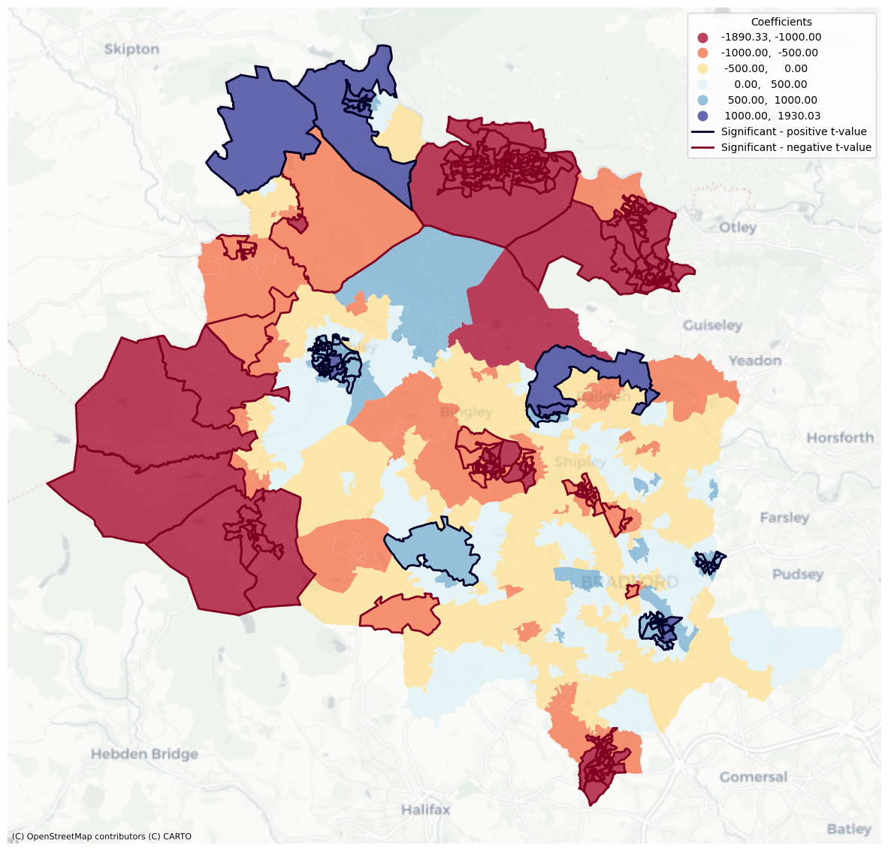
    


Health deprivation (figure 7.4.3.) displays clusters of negative relationships in the north and Bradford city centre. Positive relationships exist in the northwest, south and suburbs north of Bradford city centre. This contrasts education deprivation but is not unexpected given higher levels of health deprivation shown in figure 6.3.3. across the district and that the spatial pattern of this varied compared to other deprivation dimensions.

#### Figure 7.4.3. Map of GWR model results and significance for health deprivation, by OA in the Bradford LAD
<div style="color: #808080; margin-top: 5px">
    Data Source: Author's calculations
</div>


```python
# Call the function with the required parameters
viz_coefficients_t_value(final_df, 'GWR_Health_Coefficient', GWR_Emp_sig, 'GWR_Health_tvalue_significance')
```


    


    

    


Figure 7.4.4. shows housing deprivation has large negative clusters in the north and south, and Bradford city centre. There are fewer statistically significant positive relationships across the district, with a small number in the north and east.

#### Figure 7.4.4. Map of GWR model results and significance for housing deprivation, by OA in the Bradford LAD
<div style="color: #808080; margin-top: 5px">
    Data Source: Author's calculations
</div>


```python
# Call the function with the required parameters
viz_coefficients_t_value(final_df, 'GWR_Housing_Coefficient', GWR_Emp_sig, 'GWR_Housing_tvalue_significance')
```


    


    
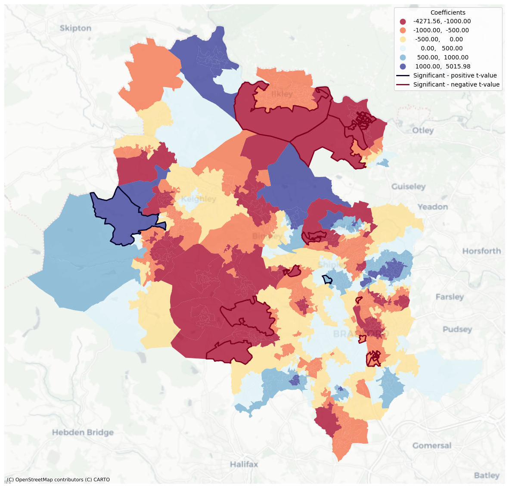
    


Lastly, mapping residuals of the GWR model demonstrate the change from the OLS regression model (figure 7.3.2.). Figure 7.4.5. shows the GWR model removed some residual autocorrelation but not all of it. This means some spatial variation has still not been captured. This is confirmed by recalculating the Moran's I value and significance. The I value has decreased to 0.23 showing clustering has been reduced but is still present. The p-value of 0.001 shows this is statistically significant.


```python
# Add GWR residuals to the final_df
final_df['GWR_residuals'] = gwr_results.resid_response
```


```python
# Calculate LISA clusters as before but with GWR_residuals
lisa_GWR_Residuals = esda.Moran_Local(final_df['GWR_residuals'], w_queen)
```


```python
# Calculate the 95% significance and quadrants as before but for the GWR_Residuals
final_df['Sig_GWR_Residuals'] = lisa_GWR_Residuals.p_sim < 0.05
final_df['Quad_GWR_Residuals'] = lisa_GWR_Residuals.q
```


```python
# Create categorical column for the map visual using if/and rules as before
final_df['LISA_GWR_Residuals'] = np.select(
    [
        (final_df['Sig_GWR_Residuals'] == False),
        (final_df['Sig_GWR_Residuals'] == True) & (final_df['Quad_GWR_Residuals'] == 1),
        (final_df['Sig_GWR_Residuals'] == True) & (final_df['Quad_GWR_Residuals'] == 2),
        (final_df['Sig_GWR_Residuals'] == True) & (final_df['Quad_GWR_Residuals'] == 3),
        (final_df['Sig_GWR_Residuals'] == True) & (final_df['Quad_GWR_Residuals'] == 4)
    ],
    [
        'Not Significant',
        'High-High',
        'Low-High',
        'Low-Low',
        'High-Low'
    ],
    default='ERROR'  # Return "ERROR" string if conditions above are not met
)
```

#### Figure 7.4.5. Map of GWR residual LISA Clusters by OA in Bradford LAD
<div style="color: #808080; margin-top: 5px">
    Data Source: Author's calculations
</div>


```python
# Define custom colormap
custom_cmap = mcolors.ListedColormap(['#E14D2A','#FACF5A','#4F9DA6','#233142','lightGrey'])

# Plot choropleth
fig, ax = plt.subplots(figsize=(15, 15))
final_df.plot(column='LISA_GWR_Residuals', 
              ax=ax, 
              categorical=True,
              legend=True,
              cmap=custom_cmap,  
              edgecolor='black',
              linewidth=0.25,
              legend_kwds={'loc': 'upper right', 'title': 'LISA GWR Residuals'})

# Add basemap
ctx.add_basemap(ax, crs=final_df.crs.to_string(), source=ctx.providers.CartoDB.Positron)

# Customize plot
ax.set_axis_off()

# Show map
plt.show()
```


    
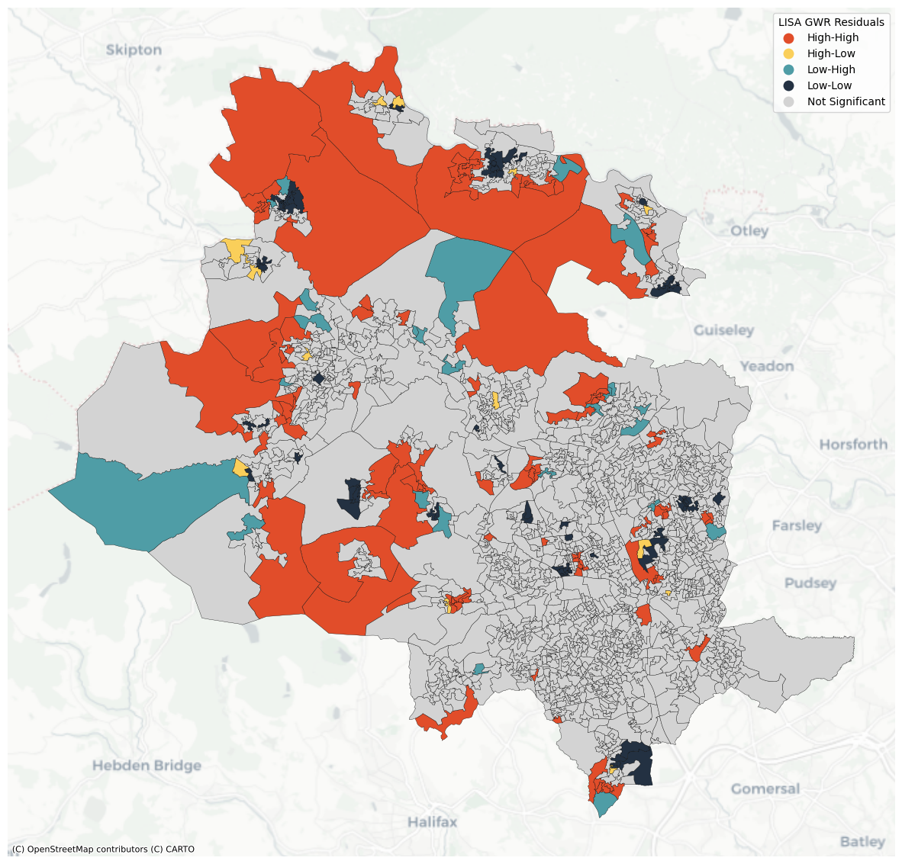
    


```python
# Calculate Moran's I
mi = esda.Moran(final_df['GWR_residuals'], w_queen)
```


```python
# I value
print(f'I value: {mi.I}')

# Significance (p value)
print(f'P value: {mi.p_sim}')
```

| I value | 0.23403007956028024 |
|:------:|:-------:|
| P value | 0.001 |
    

## 8. Discussion
Results showed deprivation and distance to greenspace are negatively correlated, reflecting much of the literature, and rejects the null hypothesis posed. However, the relationship differs by dimension and spatially. Any policy or intervention needs to consider this.

Key differentiators of this study are using deprivation dimensions and OA geographies, attempting to consider distance at a local level appropriate to the Natural England (2023) targets. However, there are limitations and opportunities for improvement.

Firstly, not all greenspace is considered. Many woodlands, moorlands, river and canal paths are not included but are publicly accessible. Including this would better reflect true greenspace but would also raise consideration of type. Different greenspace serves different purposes – for example, a children’s park versus unmaintained moorland – and so understanding access to different types may further unlock insight into what is within an accessible distance and for whom.

Secondly, the distance calculation could be improved. Utilising address data to estimate household locations, alongside road and path networks, would allow more accurate calculation of distance to greenspace. This could be an average walk time which would align better to Natural England (2023) targets.

Lastly, two limitations identified in the literature remain: quality and usage. Quality can be subjective and dependent on the greenspace’s purpose. However, a survey recording facilities, amenities, and biodiversity could develop a qualitative understanding. The Natural Environment Scoring Tool (NEST) used in Ferguson et al’s (2018) study provides a starting point. Technological advancements could improve usage data, such as GPS which was used by Mears et al (2021), however data protection, scale, and availability challenges exist.

Despite these limitations, actions could result from the findings. Deprivation differs by dimension and policy needs to consider this, as well as communities and their needs. These needs will vary by area. This is supported by research conducted on community perceptions (McEachan et al, 2018), highlighting the importance of including communities in decision-making processes.

Finally, two areas of future research are identified. Firstly, including a broader set of demographic measures beyond deprivation. Age and ethnicity are key, as shown in the literature, but no research addressed in this study has considered variables such as profession which could have an impact on how and when someone accesses greenspace. Secondly, there is opportunity to reflect on the impact of new greenspace, or improvements to current greenspace, to learn and adapt plans. CBMDC (2021) have clear goals they wish to achieve, but understanding the effectiveness of interventions is needed to ensure investments add value. Deprivation can be a relatively slow to change measure. Further studies analysing more reactive variables may enable a comprehensive review of what works in different communities.

## 9. Conclusion
This study sought to build on previous research into the relationship between distance to greenspace and deprivation by splitting deprivation into the component dimensions. The findings mirror the literature that there is a statistically significant, negative correlation between distance to greenspace and deprivation, but the use of dimensions and understanding this spatially has shown that the results vary by area. Policy implications are that decisions should be on a local scale, and interventions may vary depending on the community and their needs.

However, this is not only tied to deprivation and this study has argued that a more holistic view of demographics within communities is required, and consideration for the type of greenspace and its uses. This will allow planners to develop better suited solutions to improve community health and wellbeing, with greenspace that meets the needs and wants of the communities they serve.

 

## References
Barbosa, O., Tratalos. J.A., Armsworth, P.R., Davies, R.G., Fuller, R.A., Johnson, P. and Gaston, K.J. 2007. Who benefits from access to green space? A case study from Sheffield, UK. *Landscape and Urban Planning*. **83**(2-3), pp. 187-195.

City of Bradford Metropolitan District Council (CBMDC). 2019. *Public Health - Joint Strategic Needs Assessment*. [Online]. Bradford: City of Bradford Metropolitan District Council. [Accessed 09 January 2024]. Available from: https://jsna.bradford.gov.uk/

City of Bradford Metropolitan District Council (CBMDC). 2021. *Our Council Plan: Priorities and Principles 2021-2025*. [Online]. Bradford: City of Bradford Metropolitan District Council. [Accessed 09 January 2024]. Available from: https://www.bradford.gov.uk/media/6508/bradfordcouncilplan.pdf

City of Bradford Metropolitan District Council (CBMDC). 2022. *2021 Census: Bradford District*. [Online]. [Accessed 09 January 2024]. Available from: https://ubd.bradford.gov.uk/about-us/2021-census/

Ferguson, M., Roberts, H.E., McEachan, R.R.C. and Dallimer, M. 2018. Contrasting distributions of urban green infrastructure across social and ethno-racial groups. *Landscape and Urban Planning*. **175**, pp.136-148.

Gidlow, C.J. and Ellis, N.J. 2011. Neighbourhood green space in deprived urban communities: issues and barriers to use. *The International Journal of Justice and Sustainability*. **16**(10), pp.989-1002.

Houlden, V., Porto de Albuquerque, J., Weich, S. and Jarvis, S. 2019. A spatial analysis of proximate greenspace and mental wellbeing in London. *Applied Geography*. **109**, pp.102036.

Jia, P., Cao, X., Yang, H., Dai, S., He, P., Huang, G., Wu, T. and Wang, Y. 2021. Green space access in the neighbourhood and childhood obesity. *Obesity Reviews*. **22**(51), pp.13100.

Jones, A., Hillsdon, M. and Coombes, E. 2009. Greenspace access, use, and physical activity: Understanding the effects of area deprivation. *Preventive Medicine*. **49**(6), pp.500-505.

Kessel, A., Green, J., Pinder, R., Wilkinson, P., Grundy, C. and Lachowycz, K. 2009. Multidisciplinary research in public health: A case study of research on access to green space. *Public Health*. **123**(1), pp.32-38.

Lachowycz, K. and Jones, A.P. 2011. Greenspace and obesity: a systematic review of the evidence. *Obesity Reviews*. **12**(5), pp.183-189.

McCormick, R. 2017. Does Access to Green Space Impact the Mental Well-being of Children: A Systematic Review. *Journal of Pediatric Nursing*. **37**, pp.3-7.

McEachan, R.R.C., Yang, T.C., Roberts, H., Pickett, K.E., Arseneau-Powell, D., Gidlow, C.J., Wright, J. and Nieuwenhuijsen, M. 2018.  Availability, use of, and satisfaction with green space, and children's mental wellbeing at age 4 years in a multicultural, deprived, urban area: results from the Born in Bradford cohort study. *The Lancet Planetary Health*. **2**(6), pp.244-254.

Mears, M., Brindley, P., Barrows, P., Richardson, M. and Maheswaran, R. 2021. Mapping urban greenspace use from mobile phone GPS data. *PLoS ONE*. **16**(7), pp.0248622.

Mears, M., Brindley, P., Maheswaran, R. and Jorgensen, A. 2019. Understanding the socioeconomic equity of publicly accessible greenspace distribution: The example of Sheffield, UK. *Geoforum*. **103**, pp.126-137.

Mueller, N., Rojas-Rueda, D., Khreis, H., Cirach, M., Milà, C., Espinosa, A., Foraster, M., McEachan, R.R.C., Kelly, B., Wright, J. and Nieuwenhuijsen, M.  2018. Socioeconomic inequalities in urban and transport planning related exposures and mortality: A health impact assessment study for Bradford, UK. *Environment International*. **121**(1), pp.931-941.

Natural England. 2023. *Natural England unveils new Green Infrastructure Framework*. [Press release]. [Accessed 09 January 2024]. Available from: https://www.gov.uk/government/news/natural-england-unveils-new-green-infrastructure-framework

Office for National Statistics (ONS). 2021. *Census 2021 geographies*. [Online]. [Accessed 09 January 2024]. Available from: https://www.ons.gov.uk/methodology/geography/ukgeographies/censusgeographies/census2021geographies

Office for National Statistics (ONS). 2023a. Output Areas (2021) Boundaries EW BFC. *Open Geography Portal*. [Online]. [Accessed 11 December 2023]. Available from: https://geoportal.statistics.gov.uk/datasets/ons::output-areas-2021-boundaries-ew-bfc/about

Office for National Statistics (ONS). 2023b. Output Areas (December 2021) PWC (V3). *Open Geography Portal*. [Online]. [Accessed 11 December 2023]. Available from: https://geoportal.statistics.gov.uk/datasets/ons::output-areas-december-2021-pwc-v3/about

Office for National Statistics (ONS). 2023c. Output Area to Lower layer Super Output Area to Middle layer Super Output Area to Local Authority District (December 2021) Lookup in England and Wales V2. *Open Geography Portal*. [Online]. [Accessed 14 December 2023]. Available from: https://geoportal.statistics.gov.uk/datasets/output-area-to-lower-layer-super-output-area-to-middle-layer-super-output-area-to-local-authority-district-december-2021-lookup-in-england-and-wales-v2-1/about

Office for National Statistics (ONS). 2023d. Household deprivation in the education dimension. *Office for National Statistics*. [Online]. [Accessed 14 December 2023]. Available from: https://www.ons.gov.uk/filters/d7bede85-c97b-4b85-84a8-87b5164d3add/dimensions

Office for National Statistics (ONS). 2023e. Household deprivation in the employment dimension. *Office for National Statistics*. [Online]. [Accessed 14 December 2023]. Available from: https://www.ons.gov.uk/filters/103a7748-96d9-4e79-97e2-e1cc42ef7024/dimensions

Office for National Statistics (ONS). 2023f. Household deprivation in the health dimension. *Office for National Statistics*. [Online]. [Accessed 14 December 2023]. Available from: https://www.ons.gov.uk/filters/15149637-c729-4aa5-b817-d687cad093d8/dimensions

Office for National Statistics (ONS). 2023g. Household deprivation in the housing dimension. *Office for National Statistics*. [Online]. [Accessed 14 December 2023]. Available from: https://www.ons.gov.uk/filters/cf7beddc-198f-411a-9b66-9c690d18e3bf/dimensions

Office for National Statistics (ONS). 2023h. *How life has changed in Bradford: Census 2021*. [Online]. [Accessed 09 January 2024]. Available from: https://www.ons.gov.uk/visualisations/censusareachanges/E08000032/

Office for National Statistics (ONS). 2023i. *Rising ill-health and economic inactivity because of long-term sickness, UK: 2019 to 2023.* [Online]. [Accessed 11 January 2024]. Available from: https://rb.gy/bsf8hg

Ordnance Survey (OS). 2023. OS Open Greenspace. *Ordnance Survey*. [Online]. [Accessed 6 December 2023]. Available from: https://osdatahub.os.uk/downloads/open/OpenGreenspace

Paez, A. and Scott, D.M. 2004. Spatial statistics for urban analysis: A review of techniques with examples. *GeoJournal*. **61**, pp.53-67.

Roe, J., Aspinall, P.A. and Thompson, C.W. 2016. Understanding Relationships between Health, Ethnicity, Place and the Role of Urban Green Space in Deprived Urban Communities. *International Journal of Environmental Research and Public Health*. **13**(7), pp.681.

Wood, E., Harsant, A., Dallimer, M., Cronin de Chavez, A., McEachan, R.R.C. and Hassall, C. 2018. Not All Green Space Is Created Equal: Biodiversity Predicts Psychological Restorative Benefits From Urban Green Space. *Frontiers in Psychology*. **9**, pp2320.

## Appendix 1 - Wrangled dataframes
This appendix contains visual checks of the top five rows of the wrangled dataframes created in section 5.

#### Bradford OA polygons dataframe


```python
Bradford_OA_polygons.head()
```


<table border="1" class="dataframe">
  <thead>
    <tr style="text-align: right;">
      <th></th>
      <th>OA21CD</th>
      <th>Polygon</th>
      <th>City</th>
    </tr>
  </thead>
  <tbody>
    <tr>
      <th>0</th>
      <td>E00053353</td>
      <td>POLYGON ((415817.093 440872.597, 415821.094 44...</td>
      <td>Bradford</td>
    </tr>
    <tr>
      <th>1</th>
      <td>E00053354</td>
      <td>POLYGON ((415078.000 439967.001, 415058.323 43...</td>
      <td>Bradford</td>
    </tr>
    <tr>
      <th>2</th>
      <td>E00053355</td>
      <td>POLYGON ((416252.367 439816.041, 416253.270 43...</td>
      <td>Bradford</td>
    </tr>
    <tr>
      <th>3</th>
      <td>E00053356</td>
      <td>POLYGON ((416668.000 439392.028, 416667.653 43...</td>
      <td>Bradford</td>
    </tr>
    <tr>
      <th>4</th>
      <td>E00053357</td>
      <td>POLYGON ((415143.909 439176.235, 415143.000 43...</td>
      <td>Bradford</td>
    </tr>
  </tbody>
</table>
</div>


#### Bradford OA population weighted centroids dataframe


```python
Bradford_OA_PWC.head()
```


<table border="1" class="dataframe">
  <thead>
    <tr style="text-align: right;">
      <th></th>
      <th>OA21CD</th>
      <th>PWC</th>
    </tr>
  </thead>
  <tbody>
    <tr>
      <th>0</th>
      <td>E00053353</td>
      <td>POINT (413638.052 439495.615)</td>
    </tr>
    <tr>
      <th>1</th>
      <td>E00053354</td>
      <td>POINT (414837.013 439813.246)</td>
    </tr>
    <tr>
      <th>2</th>
      <td>E00053355</td>
      <td>POINT (416162.559 439674.009)</td>
    </tr>
    <tr>
      <th>3</th>
      <td>E00053356</td>
      <td>POINT (416591.137 439417.227)</td>
    </tr>
    <tr>
      <th>4</th>
      <td>E00053357</td>
      <td>POINT (414671.681 439110.823)</td>
    </tr>
  </tbody>
</table>
</div>


#### Bradford greenspace polygons (unique list)


```python
Bradford_greenspace_site_unique.head()
```


<table border="1" class="dataframe">
  <thead>
    <tr style="text-align: right;">
      <th></th>
      <th>Greenspace_ID</th>
      <th>Type</th>
      <th>Polygon</th>
    </tr>
  </thead>
  <tbody>
    <tr>
      <th>0</th>
      <td>0295ED18-D538-5C37-E063-AAEFA00A445E</td>
      <td>Playing Field</td>
      <td>POLYGON Z ((414018.070 438415.690 0.000, 41399...</td>
    </tr>
    <tr>
      <th>1</th>
      <td>0295ED18-E5D4-5C37-E063-AAEFA00A445E</td>
      <td>Playing Field</td>
      <td>POLYGON Z ((415193.700 439129.550 0.000, 41519...</td>
    </tr>
    <tr>
      <th>2</th>
      <td>0295ED18-F2F3-5C37-E063-AAEFA00A445E</td>
      <td>Playing Field</td>
      <td>POLYGON Z ((415690.440 439919.060 0.000, 41568...</td>
    </tr>
    <tr>
      <th>3</th>
      <td>0295ECC9-0C25-5C37-E063-AAEFA00A445E</td>
      <td>Play Space</td>
      <td>POLYGON Z ((416739.570 439592.210 0.000, 41675...</td>
    </tr>
    <tr>
      <th>4</th>
      <td>0295ECC7-FBFC-5C37-E063-AAEFA00A445E</td>
      <td>Play Space</td>
      <td>POLYGON Z ((415991.960 438808.610 0.000, 41598...</td>
    </tr>
  </tbody>
</table>
</div>


#### Nearest greenspace to each OA (unique list)


```python
unique_nearest_greenspace.head()
```


<table border="1" class="dataframe">
  <thead>
    <tr style="text-align: right;">
      <th></th>
      <th>OA21CD</th>
      <th>Greenspace_ID</th>
      <th>Type</th>
      <th>Distance</th>
    </tr>
  </thead>
  <tbody>
    <tr>
      <th>0</th>
      <td>E00053353</td>
      <td>0295ED18-D538-5C37-E063-AAEFA00A445E</td>
      <td>Playing Field</td>
      <td>1000.455806</td>
    </tr>
    <tr>
      <th>1</th>
      <td>E00053354</td>
      <td>0295ED18-E5D4-5C37-E063-AAEFA00A445E</td>
      <td>Playing Field</td>
      <td>771.145845</td>
    </tr>
    <tr>
      <th>2</th>
      <td>E00053355</td>
      <td>0295ED18-F2F3-5C37-E063-AAEFA00A445E</td>
      <td>Playing Field</td>
      <td>418.265674</td>
    </tr>
    <tr>
      <th>3</th>
      <td>E00053356</td>
      <td>0295ECC9-0C25-5C37-E063-AAEFA00A445E</td>
      <td>Play Space</td>
      <td>194.292561</td>
    </tr>
    <tr>
      <th>4</th>
      <td>E00053357</td>
      <td>0295ED18-E5D4-5C37-E063-AAEFA00A445E</td>
      <td>Playing Field</td>
      <td>432.352481</td>
    </tr>
  </tbody>
</table>
</div>


#### Independent variables dataframe


```python
Ind_vars.head()
```


<table border="1" class="dataframe">
  <thead>
    <tr style="text-align: right;">
      <th></th>
      <th>Output Areas Code</th>
      <th>HHD_dep_education_PC</th>
      <th>HHD_dep_employment_PC</th>
      <th>HHD_dep_health_PC</th>
      <th>HHD_dep_housing_PC</th>
    </tr>
  </thead>
  <tbody>
    <tr>
      <th>0</th>
      <td>E00053353</td>
      <td>28.3</td>
      <td>11.5</td>
      <td>33.6</td>
      <td>7.8</td>
    </tr>
    <tr>
      <th>1</th>
      <td>E00053354</td>
      <td>17.3</td>
      <td>6.8</td>
      <td>30.8</td>
      <td>5.3</td>
    </tr>
    <tr>
      <th>2</th>
      <td>E00053355</td>
      <td>11.2</td>
      <td>4.9</td>
      <td>22.0</td>
      <td>1.6</td>
    </tr>
    <tr>
      <th>3</th>
      <td>E00053356</td>
      <td>21.5</td>
      <td>4.2</td>
      <td>34.0</td>
      <td>4.9</td>
    </tr>
    <tr>
      <th>4</th>
      <td>E00053357</td>
      <td>14.2</td>
      <td>3.5</td>
      <td>21.3</td>
      <td>0.7</td>
    </tr>
  </tbody>
</table>
</div>


